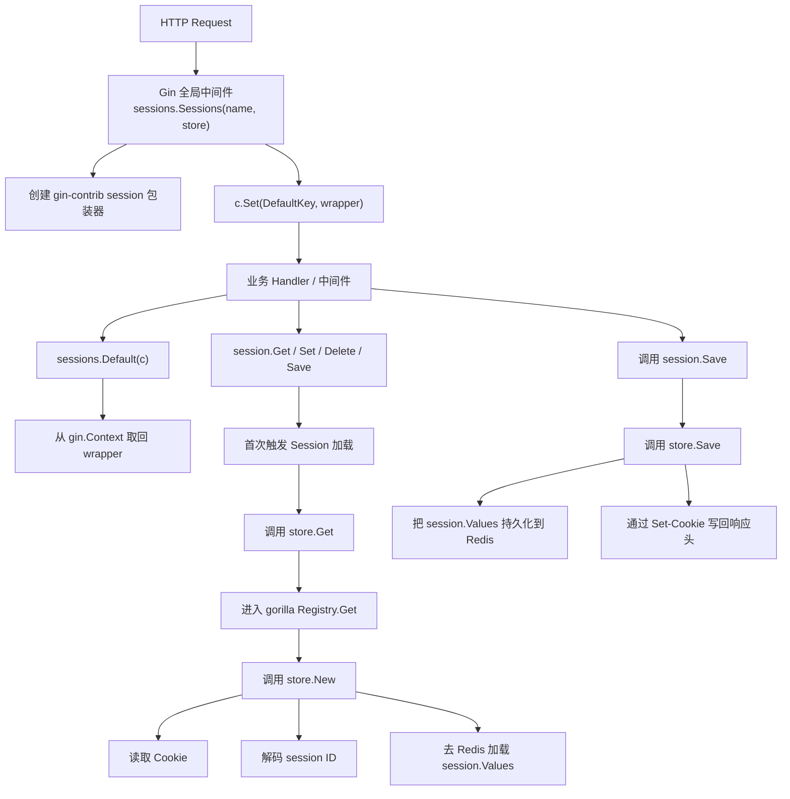
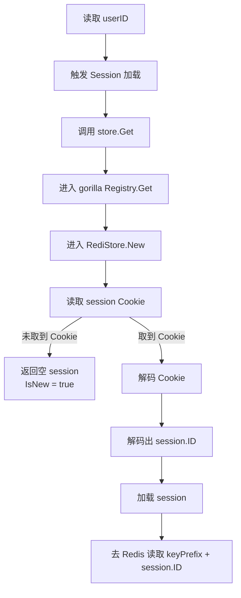
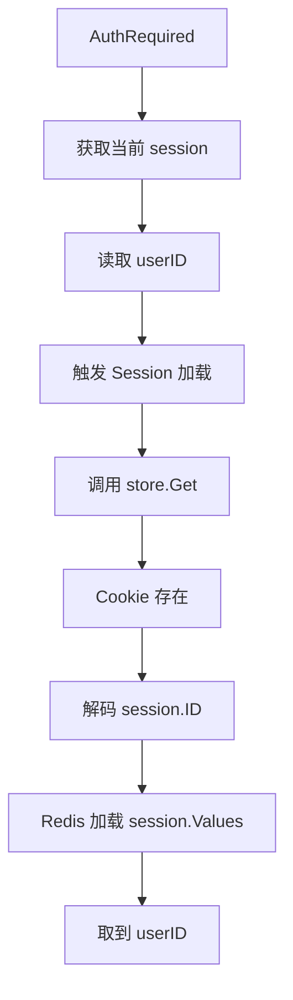
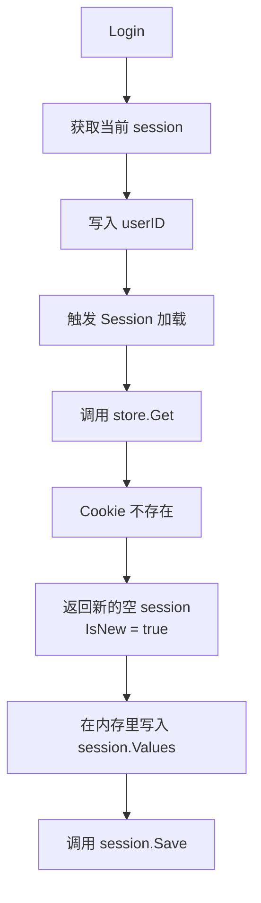
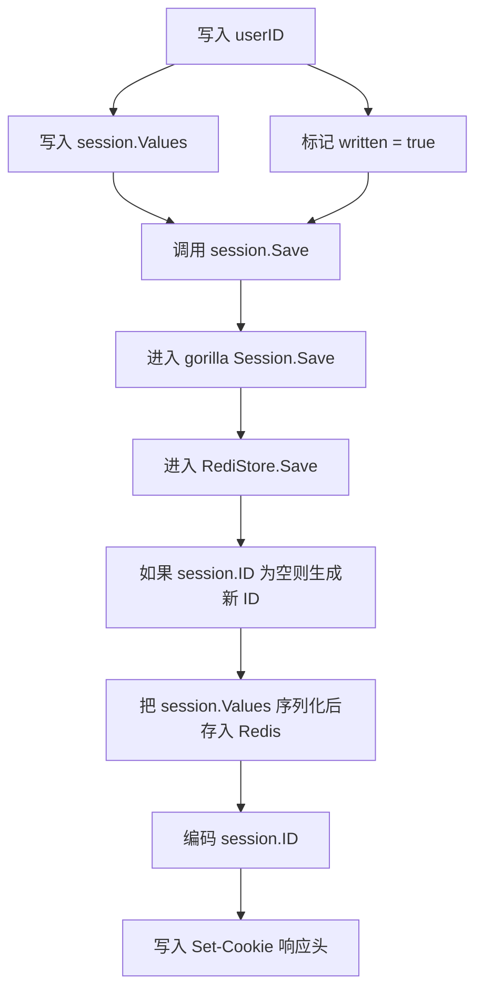

## 前言

在 Gin 项目里接入 `session` 认证时，应用层的写法通常比较直接：登录时 `session.Set(...)`，鉴权时 `session.Get(...)`，最后 `session.Save()`。

如果继续追问下面两个问题，就需要回到源码层面：

1. 全局中间件到底在请求进入时做了什么？
2. 为什么 `AuthRequired` 能“自动”从 Cookie 找回用户，而 `Login` 又能在没有旧 Cookie 的情况下创建新会话？

这篇文章不展开 Session 的基础概念，而是直接顺着源码梳理调用链路。

<!-- truncate -->

先说明版本背景：

- Gin：`v1.12.0`
- Session 中间件：`github.com/gin-contrib/sessions`
- 底层会话抽象：`github.com/gorilla/sessions`
- Redis Store：`github.com/boj/redistore`

> 如果你项目里还在使用旧的 `github.com/gin-gonic/contrib/sessions` 路径，核心思想仍然相近，但本文以下源码链路以当前 `gin-contrib/sessions` 为准。

## 常见应用场景

先看一段典型的 Gin + Redis Session 认证代码：

```go
// main.go
func main() {
	config.LoadEnv()

	db, err := database.New()
	if err != nil {
		log.Fatalf("connect database: %v", err)
	}
	defer db.Close()

	if err := db.Migrate(context.Background()); err != nil {
		log.Fatalf("migrate database: %v", err)
	}

	store, err := appsession.NewRedisStore()
	if err != nil {
		log.Fatalf("create session store: %v", err)
	}

	r := gin.Default()

	// 注册全局 session 中间件
	r.Use(sessions.Sessions("session", store))

	r.GET("/swagger/*any", ginSwagger.WrapHandler(swaggerFiles.Handler))
	router.RegisterRouter(r, db.Client)

	addr := config.GetEnv("SERVER_ADDR", ":8080")
	if err := r.Run(addr); err != nil {
		log.Fatalf("run server: %v", err)
	}
}

// router/user.go
func registerUser(api *gin.RouterGroup, client *ent.Client) {
	repo := repository.New(client)
	svc := user.NewService(repo)
	h := user.NewUserHandler(svc)

	u := api.Group("/user")
	{
		u.POST("/register", h.Register)
		u.POST("/login", h.Login)

		auth := u.Group("", middleware.AuthRequired())
		{
			auth.POST("/logout", h.Logout)
			auth.GET("/current", h.CurrentUser)
			auth.GET("/search/tags", h.SearchByTags)
			auth.POST("/update", h.Update)
			auth.GET("/match", h.MatchUsers)
		}
	}
}

// auth/middleware.go
const SessionKeyUserID = "userID"

func AuthRequired() gin.HandlerFunc {
	return func(c *gin.Context) {
		session := sessions.Default(c)
		uid := session.Get(SessionKeyUserID)
		if uid == nil {
			c.JSON(http.StatusUnauthorized, resp.FailWithCode(resp.NotLogin, ""))
			c.Abort()
			return
		}
		c.Set(SessionKeyUserID, uid)
		c.Next()
	}
}
```

从业务代码视角看，这套用法很直接：

- `main.go` 注册全局 session 中间件
- `Login` 写入登录态
- `AuthRequired` 读取登录态

但从源码层面看，更重要的问题不是“怎么用”，而是“为什么它能这样工作”。

## 先看全貌：一次请求里的 session 链路

在进入细节前，先给出整体调用链：



这条链路里最关键的一点是：**全局中间件并不会在请求开始时就访问 Redis，而是把真正的读取动作延迟到第一次 `Get` / `Set` / `Save` 等操作发生时。**

本文后面的分析都围绕这个事实展开：**中间件负责注入访问入口，真正的数据访问由懒加载触发。**

## 一、全局中间件做的不是“读取 Session”，而是“注入访问入口”

先看 `gin-contrib/sessions` 的入口：

```go
// github.com/gin-contrib/sessions/sessions.go
func Sessions(name string, store Store) gin.HandlerFunc {
	return func(c *gin.Context) {
		s := &session{name, c.Request, store, nil, false, c.Writer}
		c.Set(DefaultKey, s)
		defer context.Clear(c.Request)
		c.Next()
	}
}
```

从这段代码可以直接得到三个结论：

1. 全局中间件没有立刻读取 Cookie。
2. 全局中间件没有立刻访问 Redis。
3. 它只是创建了一个 `session` 包装器，并塞进 `gin.Context`。

这个包装器里保存了后续访问 session 所需的几个关键字段：

- `request`：后面读 Cookie 要用
- `writer`：后面写 `Set-Cookie` 响应头要用
- `store`：后面真正读写底层 session 数据要用
- `session *sessions.Session`：当前还没加载，初始为 `nil`

也就是说，这一步的作用是在当前请求上下文中挂载 session 访问入口，而不是立即读取登录态。

## 二、`sessions.Default(c)` 只是从上下文里把包装器拿出来

应用层无论是在 `AuthRequired` 里还是 `Login` 里，通常都会先这样写：

```go
session := sessions.Default(c)
```

对应源码如下：

```go
// github.com/gin-contrib/sessions/sessions.go
func Default(c *gin.Context) Session {
	return c.MustGet(DefaultKey).(Session)
}
```

这一步同样没有任何 I/O，只是在做两件事：

1. 用固定 key 从 `gin.Context` 里取值
2. 断言成 `Session` 接口后返回

因此，`sessions.Default(c)` 本身不会去 Redis 读数据，它只是取回之前由中间件注入的包装器。

## 三、懒加载发生在 `Session()`

`gin-contrib/sessions` 的 `Get` / `Set` / `Save` 都会围绕一个核心方法展开：

```go
// github.com/gin-contrib/sessions/sessions.go
type session struct {
	name    string
	request *http.Request
	store   Store
	session *sessions.Session
	written bool
	writer  http.ResponseWriter
}

func (s *session) Get(key interface{}) interface{} {
	return s.Session().Values[key]
}

func (s *session) Set(key interface{}, val interface{}) {
	s.Session().Values[key] = val
	s.written = true
}

func (s *session) Save() error {
	if s.Written() {
		e := s.Session().Save(s.request, s.writer)
		if e == nil {
			s.written = false
		}
		return e
	}
	return nil
}

func (s *session) Session() *sessions.Session {
	if s.session == nil {
		var err error
		s.session, err = s.store.Get(s.request, s.name)
		if err != nil {
			slog.Error(errorFormat, "err", err)
		}
	}
	return s.session
}
```

这里有两个关键点。

### 1. 懒加载的判断条件是 `s.session == nil`

这意味着：

- 当前请求第一次访问 session 时，才会调用 `store.Get(...)`
- 一旦加载过，后续同一个请求内再访问，就直接复用内存中的 `s.session`

因此，懒加载的触发点不是全局中间件，而是 **第一次调用 `s.Session()`**。

### 2. `written` 不是“是否已加载”，而是“是否被修改过”

这两个概念很容易混淆。

- `s.session == nil`：表示底层 `*gorilla/sessions.Session` 还没取出来
- `s.written == true`：表示本次请求里 session 内容被改动过，需要在 `Save()` 时持久化

也就是说：

- **是否加载过**，看 `s.session`
- **是否需要保存**，看 `s.written`

## 四、`store.Get` 背后不是直接读 Redis，而是先进入 gorilla 的 Registry

当 `Session()` 首次执行时，会调用：

```go
s.store.Get(s.request, s.name)
```

如果当前使用的是 Redis store，这条调用链会继续进入 `redistore` 和 `gorilla/sessions`。

先看 gorilla 的 `Registry.Get`：

```go
// github.com/gorilla/sessions/sessions.go
func (s *Registry) Get(store Store, name string) (session *Session, err error) {
	if !isCookieNameValid(name) {
		return nil, fmt.Errorf("sessions: invalid character in cookie name: %s", name)
	}
	if info, ok := s.sessions[name]; ok {
		session, err = info.s, info.e
	} else {
		session, err = store.New(s.request, name)
		session.name = name
		s.sessions[name] = sessionInfo{s: session, e: err}
	}
	session.store = store
	return
}
```

这段代码说明了一个容易忽略的点：

**同一个请求里，gorilla 还会再维护一层 Registry 缓存。**

作用是：

- 第一次按 `name` 获取 session 时，调用 `store.New(...)`
- 后续同一个请求再获取相同名字的 session，直接复用 Registry 里那份对象

所以，当前请求内的复用其实有两层：

1. `gin-contrib` 包装器里的 `s.session`
2. `gorilla/sessions` 的 `Registry`

这样可以避免在同一个请求里重复解码 Cookie，以及重复创建底层 session 对象。

## 五、Redis Store 真正的读取过程：Cookie -> 解码 SID -> Redis 加载 Values

继续往下看 Redis store 的 `New`：

```go
// github.com/boj/redistore/redistore.go
func (s *RediStore) New(r *http.Request, name string) (*sessions.Session, error) {
	var (
		err error
		ok  bool
	)
	session := sessions.NewSession(s, name)
	options := *s.Options
	session.Options = &options
	session.IsNew = true

	if c, errCookie := r.Cookie(name); errCookie == nil {
		err = securecookie.DecodeMulti(name, c.Value, &session.ID, s.Codecs...)
		if err == nil {
			ok, err = s.load(session)
			session.IsNew = err != nil || !ok
		}
	}
	return session, err
}
```

这段逻辑才是真正完成 Cookie 到服务端 session 数据转换的地方。

它的流程可以拆成四步：

1. 先创建一个新的 `*sessions.Session` 对象，默认 `IsNew = true`
2. 尝试从请求里读取名为 `name` 的 Cookie
3. 如果 Cookie 存在，用 `securecookie.DecodeMulti(...)` 解码出 `session.ID`
4. 再用这个 `session.ID` 去 Redis 里加载真正的 `session.Values`

对应流程图如下：



这里需要澄清一个细节：

**浏览器 Cookie 里保存的并不是“裸的 session ID”，而是经过 `securecookie` 编码后的值。**

也就是说：

- Redis 里真正用来索引数据的是 `session.ID`
- 浏览器里拿到的是这个 `session.ID` 的安全编码结果

这比“Cookie 中直接明文保存 SID”更准确。

## 六、为什么 `AuthRequired` 能读到数据，而 `Login` 常常拿到的是空 Session？

看到这里，这个问题就可以解释清楚了。

### 场景一：鉴权请求 `AuthRequired`

如果浏览器之前已经登录过，那么它这次请求会自动带上 session Cookie。

于是链路会变成：



这也是 `session.Get(SessionKeyUserID)` 能直接取到值的原因。

### 场景二：登录请求 `Login`

用户第一次登录时，往往还没有旧的 session Cookie。

于是链路会变成：



也就是说，`Login` 这条链路并不是“找回旧会话”，而是：

1. 拿到一个新的空 Session
2. 在这个空 Session 上写入用户数据
3. 再通过 `Save()` 把它正式落库并写回 Cookie

## 七、`Save()` 到底做了什么：Redis 持久化 + Set-Cookie

写入流程继续往下看：

```go
// github.com/gorilla/sessions/sessions.go
func (s *Session) Save(r *http.Request, w http.ResponseWriter) error {
	return s.store.Save(r, w, s)
}
```

再看 Redis store 的 `Save`：

```go
// github.com/boj/redistore/redistore.go
func (s *RediStore) Save(r *http.Request, w http.ResponseWriter, session *sessions.Session) error {
	if session.Options.MaxAge < 0 {
		if err := s.delete(session); err != nil {
			return err
		}
		http.SetCookie(w, sessions.NewCookie(session.Name(), "", session.Options))
	} else {
		if session.ID == "" {
			session.ID = strings.TrimRight(base32.StdEncoding.EncodeToString(securecookie.GenerateRandomKey(32)), "=")
		}
		if err := s.save(session); err != nil {
			return err
		}
		encoded, err := securecookie.EncodeMulti(session.Name(), session.ID, s.Codecs...)
		if err != nil {
			return err
		}
		http.SetCookie(w, sessions.NewCookie(session.Name(), encoded, session.Options))
	}
	return nil
}
```

写入链路可以概括成下面这张图：



这里可以再得到两个结论：

### 1. Redis 里存的是会话数据，Cookie 里存的是“编码后的 session.ID”

这是 Redis session 模式下最核心的职责分离：

- **Redis**：存真实会话数据
- **Cookie**：只存“如何找到这份会话数据”的凭证

### 2. `Save()` 不只是“保存到 Redis”，还负责把新凭证写回浏览器

所以如果登录逻辑里只 `Set` 不 `Save`，那么：

- 服务端内存里确实改了 `session.Values`
- 但客户端拿不到新的 Cookie
- 下一次请求也就找不回这份会话

## 八、从源码回看“懒加载”设计的效果

结合前面的调用链，可以总结这套设计的几个特点。

### 1. 不访问 Session 的请求，根本不会触发底层读取

比如某个公开接口只是返回文章列表，它虽然经过了全局 session 中间件，但如果业务代码里从头到尾都没调用 `sessions.Default(c)` 之后的 `Get` / `Set` / `Save`，那它就不会真的去解析 Cookie，更不会去 Redis 查数据。

这就是懒加载带来的直接效果：**把会话读取成本推迟到真正需要的时刻。**

### 2. 应用层只面向统一接口，不关心底层存储差异

应用层始终写的是：

```go
session := sessions.Default(c)
session.Get("userID")
session.Set("userID", id)
session.Save()
```

而底层究竟是：

- Redis store
- Cookie store
- Memory store

对应用层都是透明的。

这也是 `store` 抽象的意义：**把“会话如何存储”与“会话如何使用”分离开。**

## 九、不同 Store 的差异，主要体现在“落盘位置”，不是调用方式

从 `gin-contrib/sessions` 的设计看，所有 store 的上层调用方式都差不多，差异主要发生在底层 `Store` 的实现里。

### Redis Store

- Cookie 中保存编码后的 `session.ID`
- 真实会话数据保存在 Redis
- 适合多实例部署、集中式会话管理

### Cookie Store

- 会话数据本身直接编码后放进 Cookie
- 服务端不需要额外 Redis
- 但受 Cookie 大小限制，也更依赖 Cookie 配置

### Memory Store

- 数据只在当前进程内存中
- 适合开发调试，不适合多实例生产环境

可以概括为：

> `gin-contrib/sessions` 负责提供统一中间件与统一调用接口，`gorilla/sessions` 负责会话对象与请求级 Registry，具体的 Redis / Cookie / Memory 差异则由不同 Store 实现承担。


## 总结

把整篇文章压缩成一句话：

**Gin 的 session 中间件在请求开始时只注入一个包装器，真正的 Cookie 解析与 Redis 读取发生在第一次访问 Session 时，而 `Save()` 则负责把变更后的会话数据落到 Store，并把新的 Cookie 凭证写回响应。**

如果再拆成三个关键词，那就是：

1. **Context 注入**：中间件把包装器塞进 `gin.Context`
2. **Lazy Loading**：首次 `Get` / `Set` / `Save` 才真正加载底层 session
3. **Store 抽象**：应用层统一操作，底层决定数据最终存在哪

理解了这三层之后，再回头看 `AuthRequired` 和 `Login` 里的几行代码，就能更清楚地理解这套机制的分层方式和运行过程。

> *本文部分内容由 AI 辅助生成*
