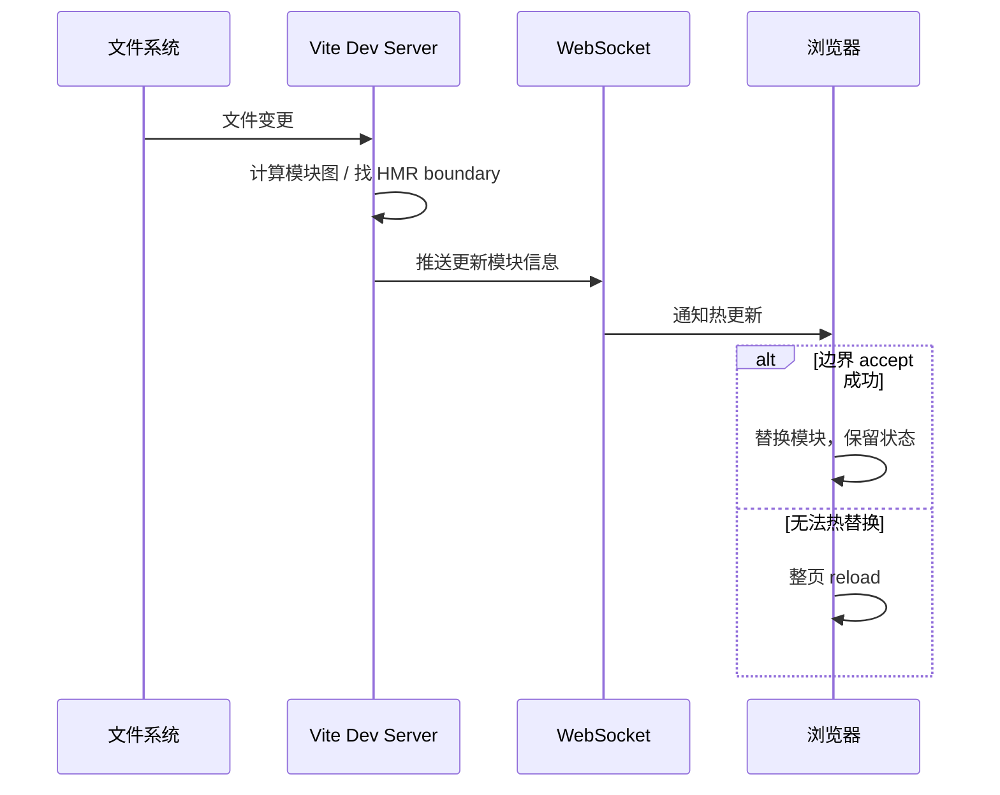

`Vite`热更新流程
<!-- truncate -->
## 前言

*`Vite`的`HMR`(热更新)仅限于在开发环境下使用,故以下默认都处于开发环境下。*

**`Vite`的实现离不开现代浏览器原生支持`ESM`的特性。**

*当声明一个`script` 标签类型为`module`时,浏览器将对其内部的`import`引用发起`HTTP`请求获取模块内容。获取到内容后再进行执行*

**值得注意的是：浏览器只会对用到的模块发起 HTTP 请求，所以 Vite 开发期不必先打包全项目，而是按需编译浏览器请求到的模块。**

## 开发模式下 Vite 的工作流程

1. 启动开发服务器，并**建立** WebSocket，用于与浏览器双向实时通信。
2. 浏览器通过 HTTP 请求模块时，开发服务器拦截请求，对对应源码做转换（依赖预构建等多用 esbuild），把浏览器可执行的模块返回。

## HMR 的工作流程

- Vite 监听项目文件变化
- 变更后沿依赖图分析影响范围；能热替换的模块走 `import.meta.hot.accept` 边界
- 通过 WebSocket 通知浏览器重新请求/替换相关模块；边界失效则 full reload

HMR **只服务于开发环境**，与生产 Rollup 打包是两条路径。

