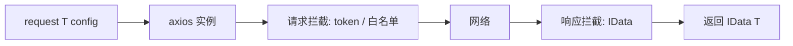

用 axios 封装练习请求/响应泛型，不是「类型体操」专题。
<!-- truncate -->
## 前言

本文借助 `axios` 请求封装作为实战用例，涉及 `TypeScript`、`axios`、`React`。

## 核心代码

```typescript
import axios from 'axios';
import type { AxiosResponse, AxiosRequestConfig } from 'axios';
import { toast } from 'react-toastify';
interface IData<T = any> {
    success: boolean;
    message: string;
    data?: T;
    token?: string;
}
const baseURL = '/api';
const Axios = axios.create({
    baseURL
});

// 登录/注册等无需带 token 的接口（不要把管理端路径误放进白名单）
const noAuthUrls = ['/user/login', '/user/register'];

Axios.interceptors.request.use(
    config => {
        if (noAuthUrls.includes(config.url || '')) {
            return config;
        }
        const token = localStorage.getItem('token');
        if (!token) {
            toast.warn('请先登录', { progress: 1 });
            setTimeout(() => {
                window.location.href = '/';
            }, 2500);
            return Promise.reject(new Error('请先登录'));
        }
        config.headers.Authorization = token;
        return config;
    },
    error => {
        toast.error(error);
        return Promise.reject(error);
    }
);
Axios.interceptors.response.use(
    (response: AxiosResponse<IData, any>) => {
        const { data } = response;
        if (data.success) {
            return response;
        }
        toast.error(data.message);
        // reject Error，方便下游读 e.message
        return Promise.reject(new Error(data.message));
    },
    error => {
        console.log(error);
        toast.error(error.message);
        return Promise.reject(error);
    }
);
async function request<T>(config: AxiosRequestConfig): Promise<IData<T>> {
    const response = await Axios.request<IData<T>>(config);
    return response.data;
}
export default request;

```

## axios 类型剖析

`axios`涉及的`api`太多,我就聚焦在`核心代码`中涉及到的

### AxiosRequestConfig

```typescript
export interface AxiosRequestConfig<D = any> {
  url?: string;
  method?: Method | string;
  baseURL?: string;
  transformRequest?: AxiosRequestTransformer | AxiosRequestTransformer[];
  transformResponse?: AxiosResponseTransformer | AxiosResponseTransformer[];
  headers?: (RawAxiosRequestHeaders & MethodsHeaders) | AxiosHeaders;
  params?: any;
  data?: D;
  timeout?: Milliseconds;
  timeoutErrorMessage?: string;
  withCredentials?: boolean;
  adapter?: AxiosAdapterConfig | AxiosAdapterConfig[];
  auth?: AxiosBasicCredentials;
  responseType?: ResponseType;
}
```

上面是`AxiosRequestConfig`的定义,我仅截取了一部分作为说明。

这里我们可以看出接口定义了一个`D`泛型来约束我们所传入`data`的类型,并且默认它为`any`类型除非我们显式约束它。

### AxiosResponse

```typescript
export interface AxiosResponse<T = any, D = any> {
  data: T;
  status: number;
  statusText: string;
  headers: RawAxiosResponseHeaders | AxiosResponseHeaders;
  config: InternalAxiosRequestConfig<D>;
  request?: any;
}
```

这里接受两个泛型,分别表示`data`和`config`的类型,默认它们为`any`类型。
其中`InternalAxiosRequestConfig`是`AxiosRequestConfig`的拓展

```typescript
 export interface InternalAxiosRequestConfig<D = any> extends AxiosRequestConfig<D> {
  headers: AxiosRequestHeaders;
}
```

## 思路

*首先,明确我们的目的:*

1. **能够对接口请求进行统一请求、响应拦截.**
2. **编写请求代码时能够约束或者说定义接口所返回的数据结构**
3. **大部分情况下`TS`能够提供较好的类型提示**

### 请求拦截

设置了权限拦截,对没有通过身份校验的人员退回验证界面。不是本文的重点,就不赘述了。

### 响应拦截⭐

```typescript
interface IData<T = any> {
    success: boolean;
    message: string;
    data?: T;
    token?: string;
}
 (response: AxiosResponse<IData, any>) => {
        const { data } = response;
        if (data.success) {
            return response;
        }
        toast.error(data.message);
        return Promise.reject(new Error(data.message));
    },
    error => {
        console.log(error);
        toast.error(error.message);
        return Promise.reject(error);
    }
```

上面我们提到了 `AxiosResponse` 接受两个泛型，分别表示 `data` 和 `config` 的类型，默认是 `any`。
这里只约束 `data`，把 `IData` 作为第一个泛型传入。`IData` 也是泛型，用来约束业务 `data` 字段的结构。

### 导出封装后的请求方法⭐⭐⭐

```typescript
async function request<T>(config: AxiosRequestConfig): Promise<IData<T>> {
    const Response = await Axios.request<IData<T>>(config);
    return Response.data;
}
export default request;
```

后续的接口请求都通过`request`去完成
使用案例:

```typescript
import request from '.';
function addProduct<T = any>(formData: FormData) {
    return request<T>({ url: '/product/add', data: formData, method: 'post' });
}
function getProductList<T = any>() {
    return request<T>({ url: '/product/list', method: 'get' });
}
export { addProduct,getProductList };

const response = await addProduct<null>(formData); //这里<null>其实就是data的类型,其他类型都是固定不变的
console.log(response.message)
console.log(response.data) //null
```

### 注意项⭐⭐

**要注意我们在导出的`request`方法是做了一层数据解构,只返回了`AxiosResponse`中的`data`字段**,也就是实际上后续的请求方法获取到的数据是`data`字段的数据,`Response`和`response`并不一样。大部分情况我们都是直接使用服务端返回给我们的数据结构去完成业务逻辑。而解构后的`response`就是服务端返回的数据。

*服务端返回的数据（Express 等）*

```typescript
res.json({ success: true, message: '商品添加成功' });
```


