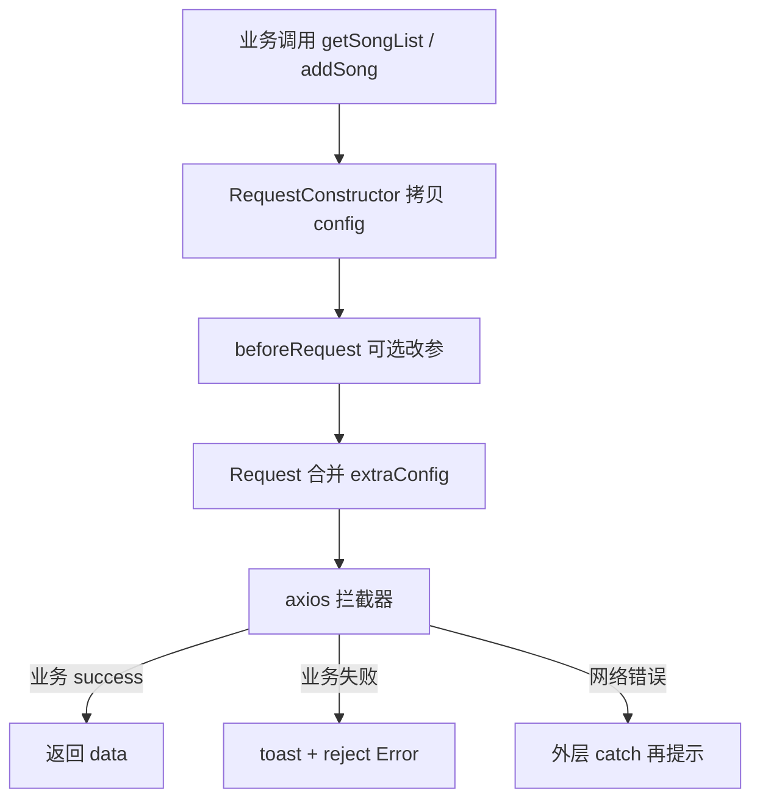

`Axios`封装
<!-- truncate -->
## 前言

本文基于`Axios`进行二次封装,旨在提供一种符合直觉且能够在大部分场景上进行使用的封装方式。

## 第一步创建Axios实例,配置统一的拦截器

```ts
import axios, { AxiosRequestConfig, AxiosResponse, InternalAxiosRequestConfig } from 'axios';
import { showMessage } from '@/component/MessageManager';
interface IResponse<T = any> {
    success: boolean;
    message: string;
    data?: T;
    token?: string;
}

export interface IQueryList<T> {
    itemList: T[]; // 列表项数组；若 T 本身已是数组类型，可再按业务调整
}
export interface IRequestConfig extends AxiosRequestConfig {
    toastError?: boolean;
}
export interface IResponseParams<T = any, D = any> extends AxiosResponse<T, D> {
    config: InternalAxiosRequestConfig & IRequestConfig;
}
const axiosInstance = axios.create({
    baseURL: '/api'
});

//无需登录验证的接口
const noAuthRequestList = ['/user/login', '/user/register', '/song/list'];

axiosInstance.interceptors.request.use(async (config: InternalAxiosRequestConfig & IRequestConfig) => {
    try {
        if (noAuthRequestList.includes(config.url||'')) {
            return config;
        } else {
            const token = localStorage.getItem('token');
            if (!token) {
                console.error('请先登录');
                // 权限认证失败的情况下
                showMessage({ type: 'warning', message: '请先登录' });
                return Promise.reject('请先登录');
            } else {
                config.headers.Authorization = token;
                return config;
            }
        }
    } catch (e: any) {
        console.error(e);
        showMessage({ type: 'error', message: e.message });
        return Promise.reject(e);
    }
});

axiosInstance.interceptors.response.use(async (response: IResponseParams<IResponse, any>) => {
    try {
        const { data } = response;
        if (data.success) {
            if (data.token) {
                localStorage.setItem('token', data.token);
            }
            return response;
        } else {
            const toastError = response.config.toastError ?? true;
            // 服务端响应了数据,但是处理结果是失败的
            if (toastError) {
                showMessage({ type: 'error', message: data.message });
            }
            // toasted: true，外层 Request 不再重复 toast
            return Promise.reject(new RequestError(data.message, true));
        }
    } catch (e: any) {
        console.error(e);
        return Promise.reject(e instanceof Error ? e : new RequestError(String(e)));
    }
});
```

> `RequestError` 定义见下方 `Request` 方法一节。

*关于拦截器的具体细节,大部分与之前保持一致[Axios 封装中的 TypeScript 实践](/blog/2024/11/06/TypeScript)*

值得注意的是 `IRequestConfig` 在原有基础上拓展了 `toastError`：服务端返回了业务失败时默认弹错误提示。

高并发或批量请求场景下，多个 toast 会刷屏，可显式传 `toastError: false` 关闭（仅限业务失败；网络错误等仍可在外层处理）。

## 封装 Request 方法，导出给外部使用

```ts
class RequestError extends Error {
    toasted: boolean;
    constructor(message: string, toasted = false) {
        super(message);
        this.toasted = toasted;
    }
}

export async function Request<T = any>(requestConfig: IRequestConfig, extraConfig?: IRequestConfig): Promise<IResponse<T>> {
    try {
        const Response = await axiosInstance.request<IResponse<T>>({ ...extraConfig, ...requestConfig });
        return Response.data;
    } catch (e: unknown) {
        // 业务失败若已在拦截器 toast，这里不再弹；网络错误等再提示
        if (e instanceof RequestError && e.toasted) {
            return Promise.reject(e);
        }
        const message = e instanceof Error ? e.message : String(e);
        showMessage({ type: 'error', message });
        return Promise.reject(e instanceof Error ? e : new Error(message));
    }
}
```

拦截器业务失败处改为：`return Promise.reject(new RequestError(data.message, true));`

`Request` 接收 `requestConfig` 与 `extraConfig`，先展开 `extraConfig` 再展开 `requestConfig`，因此 **`requestConfig` 优先级更高**。

```ts
const RequestConstructor =
    <T = any, RD = any>(baseConfig: IRequestConfig, requestDataProcessing?: IRequestDataProcessing<T, RD>) =>
    <R>(requestParams: T, extraConfig?: IRequestConfig) => {
        // 每次请求拷贝 baseConfig，禁止原地改共享 config（并发时会互相污染）
        const config: IRequestConfig = { ...baseConfig, headers: { ...baseConfig.headers } };

        // File / FormData 等无法 structuredClone 时，按场景浅拷贝或跳过 clone
        let requestParamsCopy: T = requestParams;
        try {
            requestParamsCopy = structuredClone(requestParams);
        } catch {
            requestParamsCopy = requestParams;
        }

        if (requestDataProcessing?.beforeRequest) {
            const beforeRequestResult = requestDataProcessing.beforeRequest(requestParamsCopy, extraConfig);
            if (beforeRequestResult) {
                requestParamsCopy = beforeRequestResult;
            }
        }
        if (requestDataProcessing?.afterResponse) {
            config.transformResponse = [requestDataProcessing.afterResponse];
        }
        if (config.method === 'get' || config.method === 'GET' || !config.method) {
            return Request<R>({ ...config, params: requestParamsCopy }, extraConfig);
        }
        return Request<R>({ ...config, data: requestParamsCopy }, extraConfig);
    };
export default RequestConstructor;
```

`RequestConstructor`才是我们最终默认导出的方法(`Request`方法的再次封装,设计用于常规场景,特殊情况下也可以使用具名导出的`Request`直接发送请求)。

让我们一步步分析`RequestConstructor`到底帮助我们完成了什么

- 首先`RequestConstructor`接收两个参数,`config`和`requestDataProcessing`。
- `config`的类型是`IRequestConfig`,它是我们在`Axios`实例中配置的请求配置。
- `requestDataProcessing`的类型是`IRequestDataProcessing<T, RD>`,它是一个泛型类型,它接受两个泛型参数,分别是`T`和`RD`。
- `T`是请求参数的类型,`RD`是请求数据的类型。

1. 接收`config`和`requestDataProcessing`返回一个`Request`方法。

2. `Request`方法接收两个参数,`requestParams`和`extraConfig`并返回数据请求的结果。

正如`RequestConstructor`的字面意思,它作为一个构造器,根据我们传入的`config`(基本配置参数),`requestDataProcessing`(数据处理回调函数,请求前和响应后)生成了一个新的`Request`方法。

在业务逻辑中,调用生成的`Request`方法并传入请求所需的参数`requestParams`,这时我们还可以传入一个可选的`extraConfig`来补充`config`。在部分情况下,我们可能需要动态的调整`config`的某些属性,这时就可以传入`extraConfig`来实现。

举个简单的例子

```ts
//api.ts
const fetchDemo = RequestConstructor<{name:string}>({
    url:'test',
    method:'get'
})


// something.tsx
useEffect(()=>{
const controller = new AbortController();

const request = fetchDemo({name:'something'}, {signal: controller.signal})

return ()=>{
    controller.abort();
}

},[something])
```

这是在`React`项目中非常常见的使用场景。通过`extraConfig`字段,我们可以在`something.tsx`传入一个`controller.signal`,从而实现请求的取消。在这种`config`取决于业务的场景下,光依靠`api.ts`就已经定义的`config`字段是无法实现的。

将`extraConfig`字段在业务组件里作为一个可选参数传入,即保持常规情况下简洁的配置,又能灵活的应对特殊情况。同时也符合使用直觉,不用在定义`config`时候就考虑太多,只需要把最基本的配置定义好,比如`url`和`method`(在这一步也可以定义接收参数的类型,只需要向`RequestConstructor`传递一个类型即可,提供必要的`TS`推导支持)毕竟这部分配置项跟我们的业务组件没有什么联系。

## 使用实例

```ts
//song.ts

//传入类型声明接收的参数数据结构
const getSongList = RequestConstructor<GetSongParams>({
    method: 'get',
    url: `${BASEURL}/list`
});


//传入类型声明接收的参数数据结构
const addSong = RequestConstructor<AddSongParams>(
    {
        method: 'post',
        url: `${BASEURL}/add`,
        headers: {
            'Content-Type': 'multipart/form-data'
        }
    },
    {
        // 支持直接修改params的属性
        // 同时支持返回一个新的params(Tips:返回请求所需的完整数据)
        beforeRequest(params) {
            params.audio = (params.audio as FileList)[0];
            params.image = (params.image as FileList)[0];
        }
          /**
         * // 仅支持返回完整的数据,不支持直接修改
        afterResponse(response) {
            return {
                ...response
            }
        }
         */
    }
);

// something.tsx
    const {
        data: songListResponse, // IResponse<IQueryList<ISong[]>> | undefined
        error,
        isLoading 
    } = useSWR({ key: 'songList', pageIndex: 1, pageSize: 20 }, ({ pageIndex, pageSize }) =>
        // 传入类型声明响应数据结构(getSongList<IQueryList<ISong[]>>)     
        // getSongList=RequestConstructor<GetSongParams> --> { pageIndex, pageSize }: GetSongParams
        getSongList<IQueryList<ISong[]>>({ pageIndex, pageSize })
    );

        async function onSubmit(data: AddSubmitProps) {
        try {
            console.log(data);
            await addSong(data);
            showMessage({
                type: 'success',
                message: '添加成功',
                position: 'topEnd'
            });
        } catch (error: unknown) {
            console.error(error);
            // 若拦截器已 toast，这里可只记日志；否则：
            const message = error instanceof Error ? error.message : '请求失败';
            showMessage({ type: 'error', message, position: 'topEnd' });
        }
    }

```

## 小结



- **共享 `baseConfig` 不要原地写**，每次请求浅拷贝
- **reject 统一用 `Error`**，方便 `e.message`
- **toast 职责单一**，避免拦截器与业务 catch 各弹一次
- 上传场景慎用 `structuredClone(File/FileList)`
