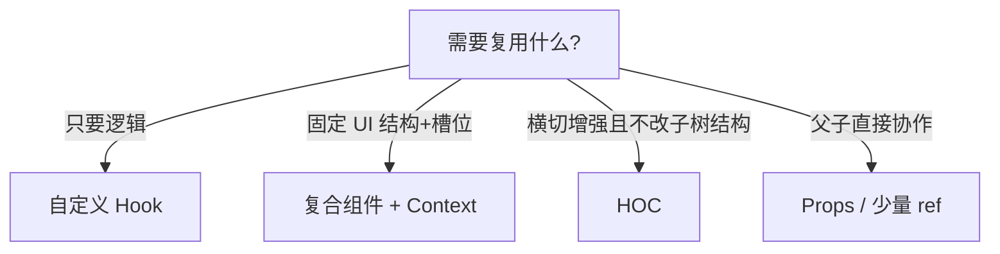

`React` 组件封装以及 `Hook` 的综合运用

<!-- truncate -->

## 前言

React 用 JSX 描述 UI。通过组件封装可以提高复用与可维护性。常见手段包括：**Props / ref**、**Context**、**复合组件（Compound Components）**、以及后文会对比的 **HOC / Hook**。

## 基于 Props 和 ref

父组件通过 Props 控制子组件；需要命令式 API 时，用 `ref` + `useImperativeHandle` 暴露有限方法。

```tsx
// 父组件
import { useState, useRef } from 'react';
import ChildComponent, { type ChildHandle } from './ChildComponent';

function ParentComponent() {
    const [count, setCount] = useState(1);
    const childRef = useRef<ChildHandle>(null);

    function letChildSay() {
        childRef.current?.childSay();
    }

    return (
        <>
            <button onClick={letChildSay}>childSay</button>
            <ChildComponent ref={childRef} count={count} />
        </>
    );
}

// 子组件
import { forwardRef, useImperativeHandle } from 'react';

export type ChildHandle = {
    childSay: () => void;
};

const ChildComponent = forwardRef<ChildHandle, { count: number }>(function ChildComponent({ count }, ref) {
    useImperativeHandle(ref, () => ({
        childSay() {
            console.log('child say');
        }
    }));

    return <div>{count}</div>;
});

export default ChildComponent;
```

局限：Props / ref **层层传递**时，动态嵌套会很难维护，于是需要 Context 或复合组件。

## 基于 Context + 复合组件

```ts
import { createContext, useContext } from 'react';

interface IDrawerContext {
    drawerVisible: boolean;
    drawerToggle: () => void;
    drawerClose: () => void;
    drawerOpen: () => void;
}

const DrawerContext = createContext<IDrawerContext | null>(null);

function useDrawerContext() {
    const context = useContext(DrawerContext);
    if (!context) {
        throw new Error('useDrawerContext must be used within a DrawerProvider');
    }
    return context;
}

export { DrawerContext, useDrawerContext };
```

`useDrawerContext` 既做运行时约束，也消掉 TS 上的 `null`。

```tsx
import useToggle from '@/Hooks/state/useToggle';
import { useDrawerContext, DrawerContext } from '@/service/context/Drawer';

function Drawer({ children }: { children: React.ReactNode }) {
    const [drawerVisible, { toggle: drawerToggle, setDefault: drawerClose, setReverse: drawerOpen }] =
        useToggle<boolean, boolean>(false, true);

    return (
        <DrawerContext.Provider
            value={{
                drawerVisible,
                drawerToggle,
                drawerClose,
                drawerOpen
            }}>
            <div className="drawer drawer-end">
                <input type="checkbox" className="drawer-toggle" checked={drawerVisible} onChange={drawerToggle} />
                {children}
            </div>
        </DrawerContext.Provider>
    );
}

Drawer.PageContent = function DrawerPageContent({ children }: { children: React.ReactNode }) {
    return <div className="drawer-content">{children}</div>;
};

Drawer.Content = function DrawerContent({ children }: { children: React.ReactNode }) {
    const { drawerToggle } = useDrawerContext();
    return (
        <div className="drawer-side">
            <label onClick={drawerToggle} className="drawer-overlay"></label>
            <div className="menu min-h-full w-[60%] bg-nav text-main md:w-80 md:p-4">{children}</div>
        </div>
    );
};

export default Drawer;
```

这是典型的**复合组件**：`Drawer` 提供 Provider；`PageContent` / `Content` 只负责槽位，后代可通过 `useDrawerContext` 开关抽屉，无需层层传 props。

### 样例

```tsx
<>
    <MessageManager />
    <Drawer>
        <Drawer.PageContent>
            <Message />
            <div className="h-screen bg-back p-2">
                {/* 主内容：Sidebar / Navbar / Outlet ... */}
            </div>
        </Drawer.PageContent>
        <Drawer.Content>{isLogin && <UserInfo />}</Drawer.Content>
    </Drawer>
</>
```

## 怎么选封装方式

| 方式 | 适合 | 注意 |
| ---- | ---- | ---- |
| 纯 Props | 结构浅、依赖明确 | 深层树会 prop drilling |
| ref 命令式 API | 聚焦、打开弹层、播放器控制 | 暴露面要小 |
| Context | 跨层共享状态/动作 | 更新粒度，避免无脑大 Context |
| 复合组件 | 有固定槽位的 UI 套件（Tabs、Drawer） | 子组件应在 Provider 内使用 |
| 自定义 Hook | 只复用逻辑、不包一层 UI | 不能单独改渲染结构 |
| HOC | 横切增强（权限、埋点、可见性） | 类型与调试成本；现代更常优先 Hook |



## 小结

- 组件名用 **PascalCase**；`children` 类型是 `React.ReactNode`（不是 `JSX.Elemnt`）
- 深层共享优先 **Context / 复合组件**，而不是无限透传
- 逻辑复用优先 **Hook**；需要包一层渲染策略再考虑 HOC（另见 [React HOC](/blog/2025/02/27/React-HOC)）

一句话：**Props 管配置，Context 管跨层协作，复合组件管槽位，Hook 管逻辑。**
