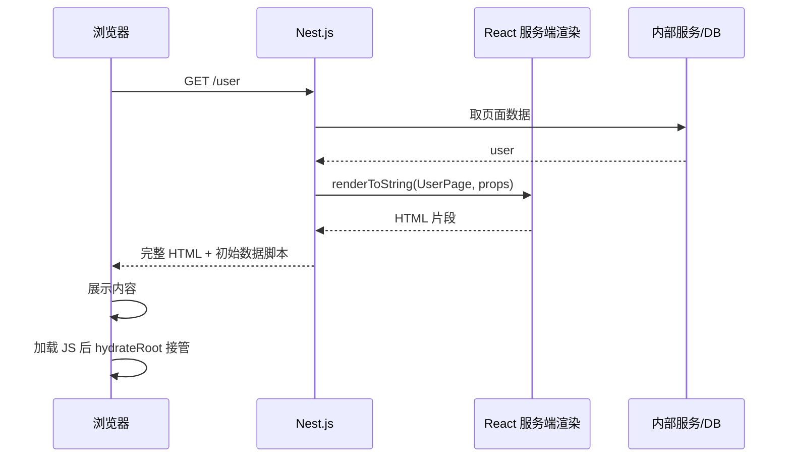

为一个 `React` + `Nest.js` 的前后端分离项目，针对特定路由增加服务端渲染（SSR + Hydration）。注意：本文讨论的是**传统 SSR 水合**，不是 React Server Components（RSC）。

<!-- truncate -->

### 先分清：SSR ≠ RSC

| 概念 | 是什么 |
| ---- | ------ |
| **SSR** | 服务端把组件渲染成 HTML 字符串发回浏览器，客户端再 **hydrate** 挂上事件与状态 |
| **RSC** | React 的服务端组件模型：服务端组件代码默认不进客户端包，通过 Server/Client 边界与 Flight 协议协作 |

下文全程是 **SSR + Hydration** 的混合渲染改造，不要和 RSC 混为一谈。

### 从纯 `CSR` 到混合渲染

在现代 Web 开发中，前后端分离已经成为主流，便于在浏览器上实现复杂交互。

但并非所有内容都需要在客户端用 JS 驱动。许多数据展示页只是“载入数据并展示”，纯 CSR 会让首屏几乎空白、依赖后续 JS 渲染，在加载性能和 SEO 上有明显短板。

当我们的项目逐渐成熟，希望优化关键页面（如用户个人资料页、产品详情页）的加载性能和 `SEO` 时，是否必须推倒重来，迁移到 `Next.js` 或 `Remix` 这类一体化框架？

答案是：不必。我们完全可以在现有的 `CSR` + `API` 架构上，通过“混合渲染”的模式，针对性地为特定路由增加服务端渲染 (`SSR`) 功能。本文以一个 `React` + `Nest.js`项目，为 /user 路由添加服务端渲染为例。(伪代码，仅供思路参考)

### 核心思想：从“分离”到“协作”

要实现混合渲染，我们需要调整前后端的角色定位：

`Nest.js` 的角色扩展：对于大部分 `API` 请求，它依然是纯粹的 `API` 服务器。但对于 /user 这个特定路由的 `GET` 请求，它将化身为一个 `Web` 服务器，负责：

调用内部服务获取数据。

在服务端将 `React` 组件和数据“渲染”成一份完整的 `HTML` 字符串。

将这份 `HTML` 返回给浏览器。

`React` 的“水合”(`Hydration`)：浏览器先展示服务端 HTML，客户端 React 加载后**接管已有 DOM**，挂上事件与状态，让页面变成可交互的 SPA，而不是推倒重建。

其他路由保持不变：除了 `/user`，如 `/dashboard`、`/settings` 仍可走纯 CSR，由 `React Router` 控制，后端只提供 API。



### 后端改造：让 `Nest.js` 具备渲染能力

这是本次改造的重点。我们需要赋予 `Nest.js` “说 `React` 的语言”的能力。

#### 1.安装依赖

首先，在 `Nest.js` 项目中安装 `React` 相关的库。

#### 2.在你的 NestJS 项目目录下

npm install react react-dom

#### 3.创建 SSR Controller

我们新建一个 `Controller`，专门用于处理 `SSR` 请求。

```TypeScript

// nestjs-project/src/ssr/ssr.controller.ts
import { Controller, Get, Res } from '@nestjs/common';
import { Response } from 'express';
import * as fs from 'fs';
import * as path from 'path';

// 导入 React 和 ReactDOMServer
import React from 'react';
import ReactDOMServer from 'react-dom/server';

// 注意：SSR 需要可在 Node 中执行的 server bundle（不要直接 require 仅面向浏览器的 chunk）
// 下面路径仅为示意
const UserPage = require('../../react-build/server/UserPage.js').default;

// 假设你有一个 UserService 来获取数据
import { UserService } from '../user/user.service';

@Controller()
export class SsrController {
  constructor(private readonly userService: UserService) {}

  @Get('user')
  async renderUserPage(@Res() res: Response) {
    // 步骤 1: 在服务端获取页面所需数据
    const user = await this.userService.findOne('some-user-id');

    // 步骤 2: 将 React 组件和数据渲染成 HTML 字符串
    const appHtml = ReactDOMServer.renderToString(
        React.createElement(UserPage, { initialUser: user })
    );

    // 步骤 3: 读取客户端的 HTML 模板
    // 这个模板是 React 项目 build 后的 index.html
    const templatePath = path.resolve('./path/to/react-project/build', 'index.html');
    let htmlTemplate = fs.readFileSync(templatePath, 'utf8');

    // 步骤 4: 将渲染的 HTML 和初始数据注入模板
    htmlTemplate = htmlTemplate
      .replace(
        '<div id="root"></div>', // 找到 React 的挂载点
        `<div id="root">${appHtml}</div>` // 替换为服务端渲染的内容
      )
      .replace(
        '</body>',
        // 将初始数据挂载到 window；生产环境务必做 HTML 安全序列化，避免 </script> 等 XSS
        `<script>window.__INITIAL_DATA__ = ${JSON.stringify(user).replace(/</g, '\\u003c')};</script></body>`
      );

    // 步骤 5: 发送最终的完整 HTML 页面
    res.send(htmlTemplate);
  }
}
```

#### 4.配置静态文件服务

浏览器收到 `HTML` 后，还需要加载 `CSS` 和 `JavaScript` 文件。我们需要让 `Nest.js` 能够提供这些静态资源。

在 `main.ts` 中配置 `ServeStaticModule`：

```TypeScript

// nestjs-project/src/main.ts
import { NestFactory } from '@nestjs/core';
import { AppModule } from './app.module';
import { NestExpressApplication } from '@nestjs/platform-express';
import { join } from 'path';

async function bootstrap() {
  const app = await NestFactory.create<NestExpressApplication>(AppModule);

  // 配置静态资源目录，指向 React 项目的 build 产物目录
  app.useStaticAssets(join(__dirname, '..', 'react-build'));

  await app.listen(3000);
}
bootstrap();
```

### 前端适配：从 `render` 到 `hydrate`

前端的改造相对简单，核心是修改 `React` 的入口文件，并确保组件能适应 `SSR` 和 `CSR` 两种场景。

#### 1.入口文件改造：拥抱 `hydrateRoot`

这是最关键的一步。将 `ReactDOM.createRoot().render()` 替换为 `ReactDOM.hydrateRoot()`。

```JavaScript

// react-project/src/index.js
import React from 'react';
import { createRoot, hydrateRoot } from 'react-dom/client';
import App from './App';

const container = document.getElementById('root');

// 仅当容器里已有服务端 HTML 时才 hydrate；空容器应 createRoot，否则容易 hydration mismatch
if (container.hasChildNodes()) {
  hydrateRoot(container, <App />);
} else {
  createRoot(container).render(<App />);
}
```

**深入探讨：能不能一律用 `hydrateRoot`？**

> **不能想当然。** `hydrateRoot` 假定 DOM 已与服务端渲染结果对齐。若容器为空（纯 CSR 首屏），正确做法是 `createRoot().render`。混用时按“是否已有 SSR HTML”分支，或保证所有入口都先产出可对齐的 HTML。

#### 2.“同构组件”的设计

我们的 `UserPage` 组件需要能同时在服务端和客户端两种环境下工作。

```JavaScript

// react-project/src/pages/UserPage.jsx
import React from 'react';

const UserPage = ({ initialUser }) => {
  // 优先使用服务端注入的数据，如果没有，则为 undefined
  const [user, setUser] = React.useState(initialUser);

  // 这个 effect 只会在客户端执行
  React.useEffect(() => {
    // 如果没有初始数据 (例如通过客户端路由跳转而来)，则在客户端获取
    if (!user) {
      console.log('在客户端获取数据...');
      // fetch('/api/user/123').then(res => res.json()).then(data => setUser(data));
    }
  }, [user]); // 依赖 user 状态

  if (!user) {
    return <div>Loading...</div>;
  }

  return (
    <div>
      <h1>用户资料</h1>
      <p><strong>ID:</strong> {user.id}</p>
      <p><strong>姓名:</strong> {user.name}</p>
      <p><strong>邮箱:</strong> {user.email}</p>
    </div>
  );
};

export default UserPage;
```

**深入探讨：为什么 `useEffect` 可以存在于 `SSR` 组件中？**

> 这是一个常见的困惑。核心在于：服务端的 ReactDOMServer.renderToString 会完全忽略 useEffect 及其内部逻辑。
>
> 在服务端：renderToString 只进行一次同步渲染，不触发任何组件挂载后的生命周期。它只关心如何根据传入的 props (initialUser) 生成 HTML。
>
> 在客户端：组件挂载后，useEffect 会正常执行。此时，它扮演了“后备方案”的角色：如果 initialUser 存在，if 条件不成立，什么也不做；如果 initialUser 不存在（意味着这是一次客户端导航），它就会触发 fetch 请求去获取数据。
>
> 这种一套代码、两种行为的组件，正是“同构 (Isomorphic)”的精髓。

### 注意事项

#### 1.如何强制 /user 路由走服务端渲染？

在你的应用中，如何链接到 /user 页面决定了它的渲染方式：

使用 `<Link to="/user">` (from react-router-dom)：会触发客户端路由，渲染流程完全在浏览器内完成，整个过程不会请求服务器 `Nest.js` 的 `SSR` 接口。

使用 `<a href="/user">`(标准 HTML 标签)：会触发整页刷新，浏览器向服务器发起一个新的 `GET` 请求，从而命中我们的 `SSR Controller`，得到一份服务端渲染的页面。
