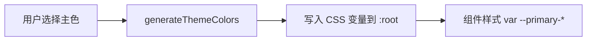

运行时切换主题色：CSS 变量 + 关键色派生。

<!-- truncate -->

## 前言

多套配色（节日皮肤、品牌换皮、用户自定义）往往不能只靠「浅色/深色」两套写死的编译结果。更灵活的做法是：

1. 样式里用 **CSS 变量**，不写死具体色值  
2. 运行时用 JS 改 `document.documentElement` 上的变量  
3. 若大量颜色由主色推导，可用派生算法减少手写 token  

编译期工具（Sass / Less / PostCSS）仍然有用：它们适合写出「引用 `var(--x)` 的结构」。无法单独满足的是：**用户随时改主色时，编译期写死的派生结果跟不上**。

## 实践

假设有三个关键色：

```css
:root {
    --primary-color: rgb(179, 30, 30);
    --secondary-color: #00ff00;
    --accent-color: #0000ff;
}
```

主色若有多个深浅档，可以手写：

```css
:root {
    --primary-color-light: #ff0000;
    --primary-color-dark: rgb(112, 4, 4);
}
```

档位一多就难维护。可用 `color-mix()` 派生：

```css
:root {
    --primary-color-light: color-mix(in srgb, var(--primary-color) 90%, #fff);
    --primary-color-dark: color-mix(in srgb, var(--primary-color) 90%, #000);
}
```

**兼容性：** `color-mix` 支持率在提升，但仍要以目标用户浏览器为准（查 [Can I Use: color-mix()](https://caniuse.com/mdn-css_types_color_color-mix)）。不满足时，用 JS 派生后写入变量更稳。

```js
import { colord, extend } from 'colord';
import mixPlugin from 'colord/plugins/mix';
extend([mixPlugin]);

function generateThemeColors(baseColor) {
    const base = colord(baseColor);
    return {
        'primary-50': base.mix('#FFFFFF', 0.95).toHex(),
        'primary-100': base.mix('#FFFFFF', 0.9).toHex(),
        'primary-200': base.mix('#FFFFFF', 0.75).toHex(),
        'primary-300': base.mix('#FFFFFF', 0.5).toHex(),
        'primary-400': base.mix('#FFFFFF', 0.25).toHex(),
        'primary-500': base.toHex(),
        'primary-600': base.mix('#000000', 0.1).toHex(),
        'primary-700': base.mix('#000000', 0.25).toHex(),
        'primary-800': base.mix('#000000', 0.5).toHex(),
        'primary-900': base.mix('#000000', 0.75).toHex(),
        'primary-950': base.mix('#000000', 0.9).toHex()
    };
}

/** 把派生结果注入 :root，样式侧继续用 var(--primary-500) 等 */
function applyThemeColors(baseColor) {
    const colors = generateThemeColors(baseColor);
    const root = document.documentElement;
    Object.entries(colors).forEach(([key, value]) => {
        root.style.setProperty(`--${key}`, value);
    });
}

// 用户选色 / 读 localStorage 后
// applyThemeColors('#b31e1e');
```

业务 CSS 只认变量：

```css
.button-primary {
    background: var(--primary-500);
    border-color: var(--primary-600);
}
.button-primary:hover {
    background: var(--primary-400);
}
```



## 小结

| 方案 | 优点 | 局限 |
| ---- | ---- | ---- |
| 编译期多套主题文件 | 简单、无运行时成本 | 不适合任意用户色 |
| `color-mix` + CSS 变量 | 声明式派生 | 兼容性、调试手感 |
| JS 派生 + `setProperty` | 灵活、可持久化 | 首屏要避免闪烁（可内联关键脚本） |

**推荐组合：** 样式结构用变量写好（构建工具照常参与）；运行时只改变量值，而不是整表重编译 CSS。
