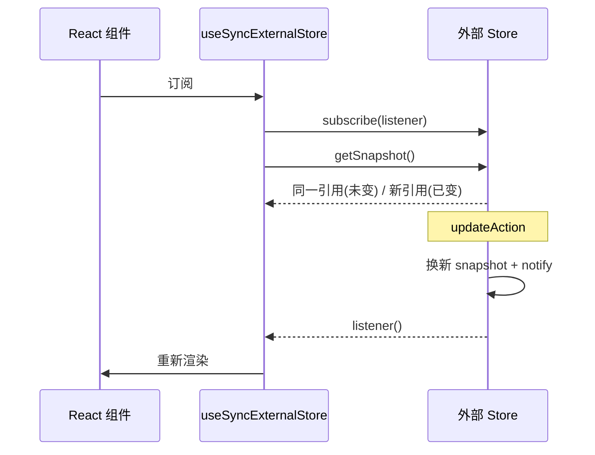

在复杂模块里，把计算与状态放在 React 外的 store，再订阅到组件——`useSyncExternalStore` 的用法笔记。

<!-- truncate -->

## 前言

在逻辑较复杂的模块中，我通常不会把重计算全部内联进 Hook，而是封装成外部 store（常见单例），再把状态接到 React 视图。

常见接法：

1. `useState` + `useEffect` 手动订阅
2. `useRef` 读最新值（**不会**触发渲染）
3. **`useSyncExternalStore`** 按外部快照订阅（本文重点）

## 概念

| 概念 | 含义 |
| ---- | ---- |
| `store` | 脱离 React 的数据源 |
| `subscribe` | 注册监听，状态变时通知 |
| `getSnapshot` | 返回当前快照；未变时引用要稳定 |
| `updateAction` | 改状态并 `notify` |
| 不可变数据 | 更新时换新对象，而不是改旧对象字段 |



## 实践

快照里尽量放**纯数据**。若 `friends` 存 `Student` 类实例，实例内部仍可变，会破坏「快照不可变」的叙事；下面用 `StudentState` / id 列表。

```ts
import { useSyncExternalStore } from 'react';

interface StudentState {
    name: string;
    age: number;
    friendIds: string[];
}

class StudentStore {
    private snapshot: StudentState;
    private listeners: (() => void)[] = [];

    constructor(name: string, age: number) {
        this.subscribe = this.subscribe.bind(this);
        this.getSnapshot = this.getSnapshot.bind(this);
        this.getServerSnapshot = this.getServerSnapshot.bind(this);

        this.snapshot = {
            name,
            age,
            friendIds: []
        };
    }

    public setName(name: string) {
        if (this.snapshot.name === name) return;
        this.snapshot = { ...this.snapshot, name };
        this._notify();
    }

    public setAge(age: number) {
        if (this.snapshot.age === age) return;
        this.snapshot = { ...this.snapshot, age };
        this._notify();
    }

    public addFriendId(id: string) {
        if (this.snapshot.friendIds.includes(id)) return;
        this.snapshot = {
            ...this.snapshot,
            friendIds: [...this.snapshot.friendIds, id]
        };
        this._notify();
    }

    public removeFriendId(id: string) {
        this.snapshot = {
            ...this.snapshot,
            friendIds: this.snapshot.friendIds.filter(f => f !== id)
        };
        this._notify();
    }

    public subscribe(listener: () => void) {
        this.listeners.push(listener);
        return () => {
            this.listeners = this.listeners.filter(l => l !== listener);
        };
    }

    /** 客户端：未变化时必须返回同一引用（Object.is） */
    public getSnapshot() {
        return this.snapshot;
    }

    /**
     * SSR / 水合：服务端渲染时用的快照。
     * 若不需要 SSR，可与 getSnapshot 相同；有差异时要避免 hydration mismatch。
     */
    public getServerSnapshot() {
        return this.snapshot;
    }

    private _notify() {
        this.listeners.forEach(listener => listener());
    }
}

const studentStore = new StudentStore('John', 20);

function useStudent() {
    const studentState = useSyncExternalStore(
        studentStore.subscribe,
        studentStore.getSnapshot,
        studentStore.getServerSnapshot
    );

    return {
        student: studentState,
        actions: studentStore
    };
}
```

### 职责对照

- **updateAction**：`setName` / `setAge` / `addFriendId` 等，改完必须换新 snapshot 再 `_notify`
- **subscribe**：登记 listener，返回取消订阅函数
- **getSnapshot**：返回当前快照引用

## 核心注意事项

1. **未变化时引用稳定**：多次 `getSnapshot()` 要用 `Object.is` 相等。

```ts
// 反例：每次 new 对象 → 永远认为变了 → 无限重渲染风险
public getSnapshot() {
    return { ...this.snapshot };
}
```

2. **快照尽量是可序列化的纯数据**，不要塞可变类实例当「真理源」。
3. **SSR** 记得第三参数 `getServerSnapshot`，否则在服务端/水合路径可能告警或 mismatch。
4. 与 `useEffect` 手写订阅相比，`useSyncExternalStore` 更利于避免并发渲染下的 **tearing**（读到不一致的外部快照）。

一句话：**外部 store 负责可变状态机；交给 React 的永远是「引用稳定的不可变快照」。**
