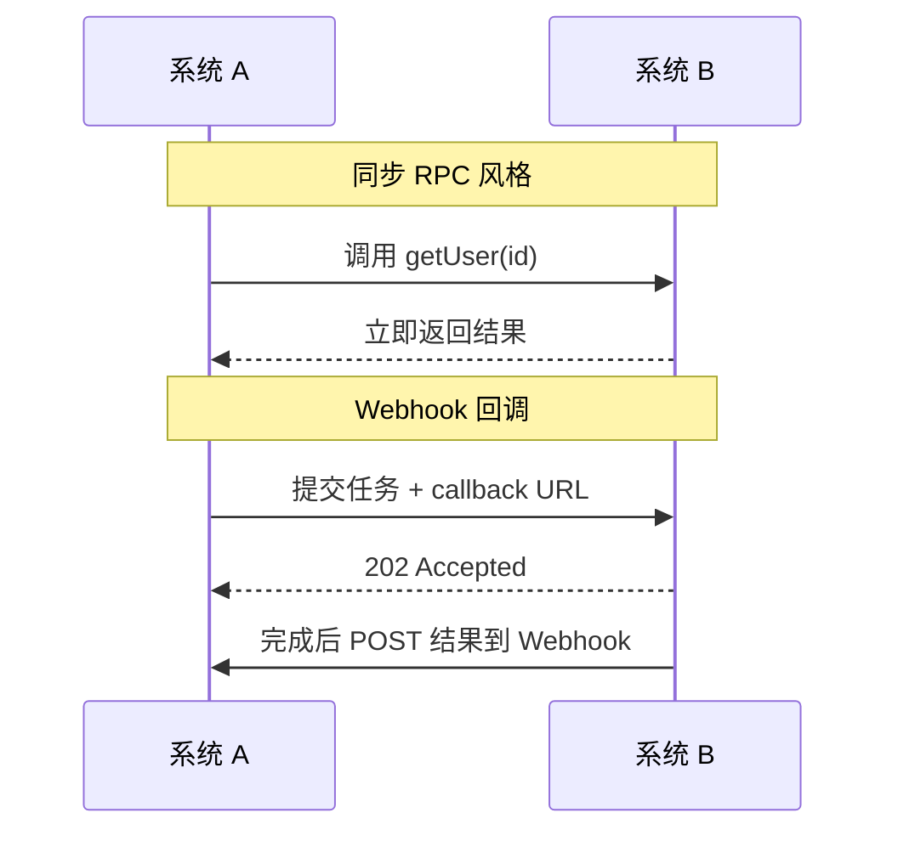

RPC 像打电话，Webhook 像回执短信：两种跨系统协作方式的分工笔记。

<!-- truncate -->

## 一、 基础概念：主动出击 vs 坐等通知

### 1. RPC (Remote Procedure Call)：微服务的“内部专线”

RPC 的全称是远程过程调用。它的核心设计哲学是：**让分布式系统间的通信，看起来就像调用本地函数一样简单。**

在单体应用中，你调用 `getUser(id)` 是在内存里找数据；在微服务中，这个调用需要跨越网络。RPC 框架（如 gRPC、Dubbo）在底层帮你把网络连接（TCP 长连接）、数据压缩（Protobuf 二进制序列化）、多路复用等“脏活累活”全干了。

* **形象比喻**：RPC 就像是**打电话**。我主动拨号给你，你在电话那头立刻处理，我在这头拿着话筒（同步或伪同步）等你告诉我结果。
* **网络特征**：通常运行在企业内网（Intranet），追求极致的低延迟和高并发，数据包体积被压缩到极致。

### 2. Webhook：连接互联网孤岛的“信鸽”

Webhook 通常被称为“反向 API”或“HTTP 回调”。它的核心设计哲学是著名的好莱坞原则：**“Don't call us, we'll call you.（别打电话给我们，有事我们会打给你）”**。

它完全基于标准的 HTTP 协议。当某个事件在系统 A 中发生时，系统 A 会向系统 B 预先提供的一个 URL 发送一个 HTTP POST 请求（通常携带 JSON 数据）。

* **形象比喻**：Webhook 就像是**留电话号码**。我去办事大厅提交了材料，工作人员说：“你先回去吧，办好了我按你留的号码发短信通知你。”
* **网络特征**：通常运行在公网（Internet），使用标准的 80/443 端口，极易穿透防火墙，天生适合跨越公司边界的通信。

---

## 二、 两者在应用架构设计中承担的角色

虽然通信方向（主动 vs 被动）和常见部署位置不同，但在很多业务场景下，RPC 和 Webhook 是**同一需求的不同解法**。共性在于：让两台计算机互相触发业务逻辑并传递数据。



### 场景 1：耗时任务的结果获取（异步处理）

假设你的系统 A 需要调用系统 B 进行“4K 视频转码”或“AI 图像生成”，这个过程需要 5 分钟。

* **若只用同步请求-响应式 RPC**：系统 A 提交任务拿到 `TaskID` 后，容易退化成定时 `checkStatus(TaskID)` 轮询，产生大量无效请求。注意：**RPC 本身也可以异步**——消息队列、回调、gRPC streaming 等都能推送结果，并不等于“只能轮询”。
* **Webhook 的解法（HTTP 回调）**：系统 A 提交任务时附带自己的 Webhook URL；完成后 B 主动 POST 结果。跨组织、公网场景特别常见。
* **结论**：跨系统、跨信任边界的异步结果通知，Webhook 往往更省事；内网若已有事件总线/流式 RPC，不必强行上 Webhook。

### 场景 2：跨系统的状态同步与事件通知

假设用户在电商平台支付成功，需要通知订单系统“更改状态并准备发货”。

* **内网环境用 RPC**：如果支付系统和订单系统都是你们公司自己写的，部署在同一个机房。支付模块扣款成功后，直接发起内部 RPC 调用 `OrderService.updateStatus(Paid)`。内网极快，强一致性有保障。
* **外网环境用 Webhook**：如果你对接的是**微信支付/支付宝**。微信不可能集成你公司的内部 RPC 框架。他们的做法是：让你在后台配置一个“支付成功回调地址（Webhook URL）”。用户付完钱，微信服务器会向你的公网 URL 发送带有签名验证的 HTTP 请求。

---

## 三、RPC 在现代全栈框架中重塑新的开发范式

过去，我们总认为 RPC 是后端微服务（Java/Go/C++）的专利，前端和后端只能通过 RESTful API (HTTP/JSON) 或 GraphQL 交互。

但随着 **Next.js、Nuxt.js** 等全栈框架的崛起，以及 **React Server Components (RSC)** 和 **Server Actions** 的出现，**RPC 风格的 DX（像调本地函数一样调服务端）** 正在补充甚至替代一部分手写 REST 胶水代码。底层传输往往仍是 HTTP，不必理解成“RPC 全面取代 REST”。

### 1. 避免常规 HTTP 请求带来的繁琐的 API 胶水代码

在传统的 SPA（单页应用）开发中，前端要获取数据，必须经历痛苦的步骤：

1. 后端写一个 `/api/getUser` 的接口。
2. 前端用 `fetch` 或 `axios` 发送 HTTP 请求。
3. 前端处理 Loading 状态、解析 JSON、处理错误。

**这本质上是在手动处理网络通信的细节。**

### 2. Next.js Server Actions：前端的“隐形 RPC”

在 Next.js 14+ 中引入的 Server Actions，完美诠释了 RPC 的核心理念——**“像调用本地函数一样调用远程代码”**。

```javascript
// app/actions.js (运行在服务器端)
'use server'
export async function updateUser(id, data) {
  await db.user.update({ where: { id }, data })
  return { success: true }
}

// app/page.jsx (运行在客户端浏览器)
import { updateUser } from './actions'

export default function Profile() {
  return (
    <form action={async (formData) => {
      // 看起来像是在调用一个普通的本地异步函数！
      const result = await updateUser(123, { name: formData.get('name') })
      console.log(result)
    }}>
      <input name="name" />
      <button type="submit">更新</button>
    </form>
  )
}
```

前端代码直接 `import` 了一个只在服务器端运行的函数 `updateUser`，并在表单提交时直接调用了它。

Next.js 框架在编译时，会自动把这个函数调用转换成一个底层的 HTTP POST 请求。它帮你处理了序列化、网络传输、反序列化。开发者完全不需要写任何 `fetch` 代码，也不需要定义 API 路由。前端和后端共享了 TypeScript 的类型定义（端到端类型安全），体验极其丝滑。

### 3. tRPC：进一步降低全栈开发的心智负担

除了框架自带的 Server Actions，社区中爆火的 **tRPC** 也是前端 RPC 化的典型代表。它允许你在不需要代码生成（像 gRPC 那样）的情况下，直接在前后端共享 TypeScript 类型，实现强类型的 RPC 调用，极大地提升了全栈开发效率。

**结论**：RPC 的思想已经突破了后端内网的限制。在现代全栈开发中，**RPC 正在取代一部分传统的 RESTful API，成为前后端无缝连接的新桥梁。**

---

## 四、 架构选型：到底该用谁？

在现代架构设计中，Webhook 和 RPC 绝不是竞争关系，而是**完美的互补关系**。我们可以通过一张表来清晰界定它们的适用边界：

| 维度 | RPC (gRPC, Dubbo, Server Actions) | Webhook |
| :--- | :--- | :--- |
| **核心定位** | 系统内部/前后端直连的“隐形管道” | 跨越互联网孤岛的“信鸽” |
| **网络边界** | **内网主导**（或同构框架内的前后端通信） | **公网主导**，标准 HTTP 轻松穿透防火墙 |
| **开发体验** | **极佳**。像调用本地函数，强类型约束 | **一般**。需手动解析 JSON，处理重试逻辑 |
| **耦合度** | **强耦合**。需共享接口定义或类型系统 | **极度松耦合**。只要能解析 HTTP 即可对接 |
| **适用场景** | 微服务内部通信、Next.js 全栈数据交互 | 支付回调、GitHub 触发 CI/CD、SaaS 集成 |

### 总结建议

1. **如果你在做微服务拆分，或使用 Next.js 进行全栈开发**：只要系统属于同一个组织，或者前后端代码在同一个代码库（Monorepo）中，毫不犹豫地拥抱 **RPC**（无论是 gRPC 还是 tRPC/Server Actions）。它能让你体验到极致的开发效率和性能。
2. **如果你在做开放平台 (Open API)**：需要与外部第三方平台（如 SaaS、支付网关、代码仓库）集成，或者需要提供事件订阅功能给你的客户， **Webhook** 是唯一的选择。

**一句话概括**：
RPC 让你在庞大的分布式系统（甚至跨越前后端）中，依然能体验到写单机代码的丝滑；而 Webhook 则赋予了你的系统与全世界任何其他互联网应用“握手联动”的能力。

> *本文部分内容由 AI 辅助生成*
