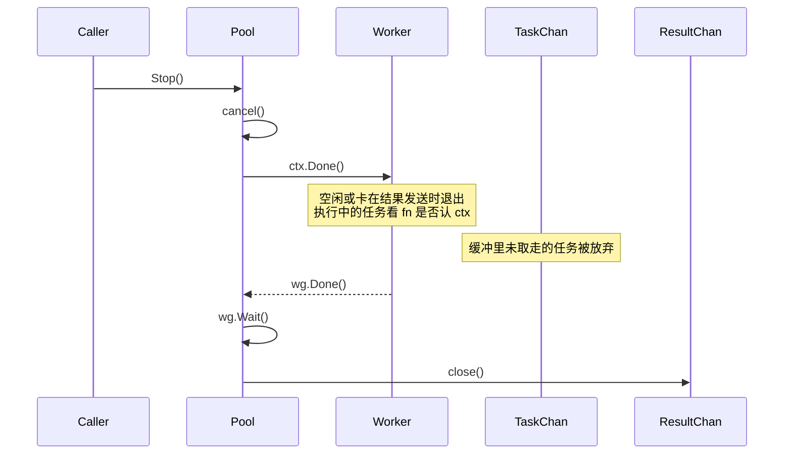
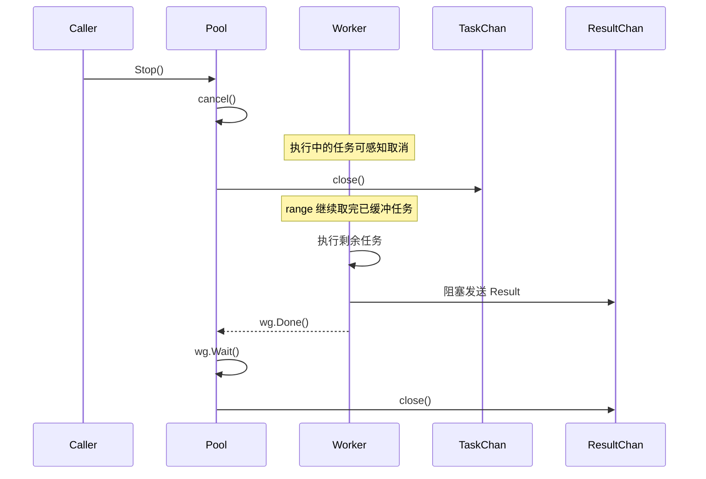

写带结果收集的 worker pool，任务分发通常不难。真正容易写岔的是**怎么停**。

停之前先把这两个问题答死，后面实现几乎是顺水推舟：

1. 已经进队、还没被 worker 拿走的任务，还要不要做？
2. 已经做完、结果还没发出去的任务，结果能不能丢？

对这两个问题的回答不同，中断机制和 API 形态就会分叉。下面按这两种答案，分别看实现。

<!-- truncate -->

## 一、先定语义，再选手段

| 维度                | A：取消优先              | B：排空优先                    |
| ------------------- | ------------------------ | ------------------------------ |
| 中断信号            | 主要靠 `context` 取消    | 取消 + `close(taskQueue)`      |
| 已入队未执行        | 放弃                     | 继续取完并执行                 |
| 已算出的结果        | 取消时可以丢             | 必须发出去                     |
| worker 退出         | `select` 听 `ctx.Done()` | `for range` 排空后退出         |
| 是否 close 任务队列 | 通常不关                 | 要关                           |
| 典型场景            | 超时、用户取消、快速失败 | 批处理、提交过的任务都要有交代 |

没有谁绝对更好，只是「停止」的含义不同：

- **A**：别干了，能停就停。
- **B**：不再接新活，但手里已接的活要做完（至少要给出结果）。

## 二、两种中断机制各自管什么

### Context 取消

`cancel()` 是广播：所有听同一个 `ctx` 的地方都会收到。

它**不会**：

- 清空 channel 里已有的数据
- 自动禁止继续往 channel 里发（发送方得自己先看 `ctx.Done()` 或别的停止标记）

它只表示一件事：**请尽快停下来**。

所以 A 的 worker 常见写法是：

```go
for {
    select {
    case <-ctx.Done():
        return
    case task := <-taskChan:
        res := task.Run(ctx)
        select {
        case <-ctx.Done():
            return // 结果可以丢
        case resultChan <- res:
        }
    }
}
```

`Stop` 可以很短：

```go
cancel()
wg.Wait()
close(resultChan)
```

队列里还没被取走的任务，就这么留在 channel 里，等 pool 不再被引用后一起被 GC 掉。

有两点别想当然：

1. **`select` 并不保证「优先 Done」**。`ctx.Done()` 和 `taskChan` 同时就绪时，Go 会随机选一个 case。取消之后，worker 仍可能再捞到一个任务；要更快停，任务函数本身也得认 `ctx`。
2. **已经在跑的任务不会被 runtime 强杀**。取消只是发信号；`task.Run(ctx)` 如果不看 `ctx`，照样跑完。

### Channel 关闭

`close(ch)` 的语义是：**不会再有新数据了**。

`for range ch` 的保证是：先把缓冲里已有的值取完，再退出。

所以 B 的 worker 通常写成：

```go
for t := range taskQueue {
    val, err := t.fn(ctx) // 运行中仍可感知取消
    resultQueue <- Result{Val: val, Err: err} // 结果必须送出，不再看 Done
}
```

`Stop` 顺序要对：

```go
cancel()           // 让正在跑的任务有机会尽快收尾
close(taskQueue)   // 让 range 把已入队任务排空
wg.Wait()
close(resultQueue) // 必须等 worker 都退出后再关
```

这里「完整性」要说清楚：

- 保证的是：**已提交进队的任务都会被 worker 取到，并且对应产生一条结果**。
- **不保证**任务业务一定成功。`Stop` 时已经 `cancel` 了，若 `fn` 遵守 `ctx`，剩余任务可能很快返回 `ctx.Err()`。B 保证的是「有结果」，不是「一定算完正确答案」。

### 一句话区分

- `ctx.Done()`：解决**正在跑的工作**怎么感知取消。
- `close(taskQueue)`：解决**队列里剩下的工作**要不要做完。

A 只用前者。B 把两者叠在一起用。

## 三、停止流程

### A：取消优先



路径短，一般不用关任务队列，也少一层「往已关闭 channel 发送」的坑。代价是：未执行任务和部分结果都可能没了。

### B：排空优先



已入队任务都会走到执行路径，结果不主动丢。代价是：提交与关闭有竞态，结果通道满了还可能把 `wg.Wait()` 卡死。

## 四、结果发送和死锁

### A：可以丢结果，所以不容易被结果通道卡住

```go
select {
case <-ctx.Done():
    return
case resultChan <- res:
}
```

取消到来时，worker 可以选择不发结果直接退。这样即便没人读 `resultChan`，`wg.Wait()` 也不至于被满缓冲永久堵住。

收集侧可以 `Stop` 后再 `range`：

```go
p.Stop()
for r := range p.Results() {
    // 只包含停之前成功发出的结果
}
```

### B：结果不丢，就必须先有人消费

```go
resultQueue <- Result{...} // 阻塞发送
```

如果 `resultQueue` 缓冲满了，调用方还没开始读，worker 会堵在发送上，`wg.Wait()` 永远等不到，`Stop` 也回不来。

所以 B 的收集顺序不能反：

```go
done := make(chan struct{})
go func() {
    defer close(done)
    for r := range h.Results() {
        results = append(results, r)
    }
}()
h.Stop() // 内部 close(taskQueue) -> wait workers -> close(results)
<-done
```

实务上更稳的做法是：提交阶段就一直有 consumer 在读；`Collect` 只是「停止接收新任务并收尾」。别把「首次消费」和「Stop」拧成一步再赌缓冲够不够大。

## 五、关不关 taskQueue

### A：可以不关

不关任务队列，从根上避开 `send on closed channel` 的 panic。

不关 **不等于** 泄漏。真正拖住内存和 goroutine 的，通常是忘了 `Stop`：worker 还活着，引用还在。正常 `Stop` 后 worker 因 `ctx.Done()` 退出，pool 不再被持有，channel 和残留任务可以被 GC 回收。和有没有 `close` 无关。

### B：要关，就得管提交竞态

`close(taskQueue)` 之后再 `Submit`，会 panic。常见处理：

1. **用 `mu + closed` 标志**（更稳妥）：`Stop` 时先置位再关 channel；`Submit` 先看标志，已关闭就返回错误。
2. **`defer recover` 把 panic 转成错误**：能兜住竞态窗口，但别把它当主设计。竞态不该靠 panic 当控制流。

```go
func (p *Pool) Submit(task Task) error {
    p.mu.Lock()
    defer p.mu.Unlock()
    if p.closed {
        return ErrPoolStopped
    }
    select {
    case <-p.ctx.Done():
        return p.ctx.Err()
    case p.taskQueue <- task:
        return nil
    }
}

func (p *Pool) Stop() {
    p.mu.Lock()
    if !p.closed {
        p.closed = true
        p.cancel()
        close(p.taskQueue)
    }
    p.mu.Unlock()

    p.wg.Wait()

    p.mu.Lock()
    if !p.resultClosed {
        p.resultClosed = true
        close(p.resultQueue)
    }
    p.mu.Unlock()
}
```

`Stop` 最好做成幂等。生产里谁调用几次 `Stop` 并不少见。

## 六、怎么用

### 批处理

```go
// A：停了就停，别假设「提交过的一定有结果」
p := Start[int](ctx, queueSize, workerSize)
for _, job := range jobs {
    _ = p.Submit(job)
}
results := p.ResultCollect() // 取消后可能少于提交数

// B：提交成功的任务，收尾时都该落到一条 Result
h := Start[int](ctx, workerCount, queueSize)
for i, job := range jobs {
    _ = h.SubmitWithIndex(job, i)
}
results := h.Collect() // 条数与成功提交数对齐；内容仍可能是 ctx.Err()
```

如果业务要求「要么全做完，要么明确失败」，B 更合适，但要把 `Result.Err` 算进成功条件，不要只看切片长度。

### 常驻服务

两种实现都建议：**独立 goroutine 持续读结果通道**。结果缓冲一满，worker 发不出去，最终会反压到提交路径。

`Stop` 之后的差别还是那句：

- A：尽快退，队列剩的可以不要。
- B：队列剩的要跑完（或至少给出结果）再退。

## 七、怎么选

| 你的真实需求                             | 选  |
| ---------------------------------------- | --- |
| 超时 / 用户取消后希望尽快停              | A   |
| 能接受丢掉未执行任务，也能接受丢部分结果 | A   |
| 已经 `Submit` 成功的任务必须有一条结果   | B   |
| 批处理要一次收齐「已提交任务」的去向     | B   |
| 想实现简单，少处理 close/提交竞态        | A   |
| 能接受多写一点关闭与反压逻辑             | B   |

选型时别把「API 好不好用」和「停止语义」绑死。带 index、可复用配置、预定义错误，A/B 都能做；那是产品封装问题，不是取消 vs 关闭的本质差异。

## 八、落地前的检查清单

写 pool 之前，把下面几条勾清楚，基本就不会选错壳、也不会埋死锁：

1. 停止后，已入队任务是丢弃还是排空？
2. 已算完的结果能不能丢？
3. 任务函数认不认 `ctx`？不认的话，「快速取消」只是口号。
4. 结果通道谁来读？读是从提交期就开始，还是 `Stop` 时才开始？
5. `Submit` 和 `Stop` 并发时，返回错误还是允许 panic？
6. `Stop` / `close(result)` 是否幂等？

结论：

- 若「停止」= **立刻终止工作**，Context 取消就够用。
- 若「停止」= **不再接新任务，但把已接的收尾**，就必须 `close` 任务队列，并认真处理结果投递、提交竞态和消费顺序。

先定语义，再写代码。语义没定就先纠结要不要 `close`、要不要 `recover`，多半会把两种模型拧成一个四不像。

> *本文部分内容由 AI 辅助生成*
