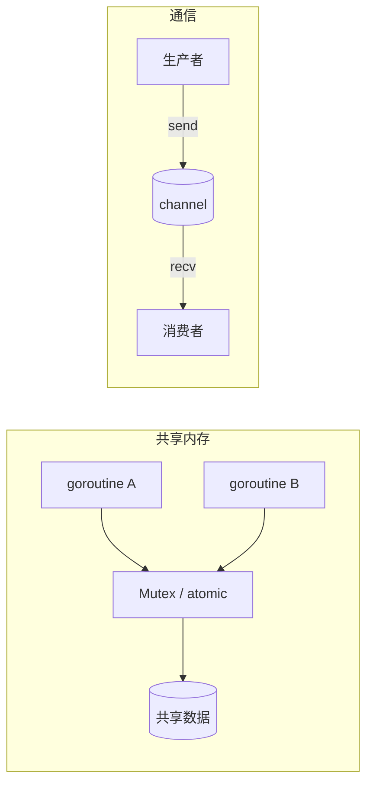
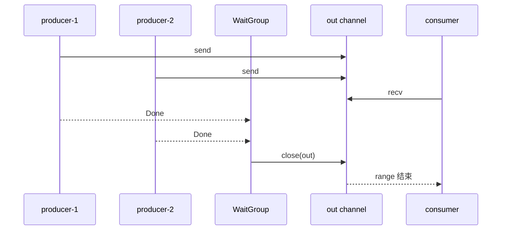

并发程序最终都要回答同一件事：**多个执行流如何安全地协作**。工程上常见两条路线：

1. **基于共享内存**：大家读写同一块数据，靠锁、原子操作等手段约束访问顺序。
2. **基于通信**：尽量不共享可变状态，把数据通过消息（在 Go 里主要是 channel）交给对方。

Go 的口号是 *Don't communicate by sharing memory; share memory by communicating*。这不是说锁没用了，而是提醒你：**默认优先用通信组织协作；共享可变状态时，要把竞争条件正面处理干净**。

下面用 Go 标准库里的工具，分别看这两条路最容易踩的坑——共享内存如何处理竞争条件，以及通信如何处理双方生命周期。

<!-- truncate -->

## 一、两条路线分别在解决什么

| 维度 | 共享内存 | 通信（CSP / channel） |
| --- | --- | --- |
| 核心抽象 | 共享变量 + 同步原语 | 消息传递 + 同步点 |
| 主要工具 | `sync.Mutex` / `RWMutex`、`atomic`、`sync.Once`、`sync.Map` | `chan`、`select`、`context`、`WaitGroup` |
| 难点 | 竞争条件、死锁、锁粒度 | 谁关 channel、谁退出、有没有人一直阻塞 |
| 适合 | 小范围共享状态、计数器、缓存结构 | 流水线、任务分发、事件流、所有权转移 |
| 心智模型 | 「这块数据谁能在什么时候碰」 | 「这条数据现在归谁管」 |

两条路不是互斥的。真实项目几乎总是混用：channel 负责编排和所有权转移，mutex 保护某个结构内部的小块可变状态。



---

## 二、基于共享内存：如何处理竞争条件

### 1. 竞争条件长什么样

竞争条件（data race）指：**至少两个 goroutine 并发访问同一块内存，其中至少一个是写，且没有同步**。

最经典的例子是无保护的计数器：

```go
package main

import (
	"fmt"
	"sync"
)

func main() {
	var (
		counter int
		wg      sync.WaitGroup
	)

	for i := 0; i < 1000; i++ {
		wg.Add(1)
		go func() {
			defer wg.Done()
			counter++ // 读-改-写不是原子操作
		}()
	}

	wg.Wait()
	fmt.Println(counter) // 大概率 < 1000
}
```

`counter++` 在机器层面通常是：读出旧值 → 加一 → 写回。两个 goroutine 可能读到同一个旧值，后写的覆盖先写的，次数就丢了。

用 race detector 一眼能抓到：

```bash
go run -race .
```

能开 race 检测的场景尽量开。它发现不了逻辑层的「业务竞争」（比如先查余额再扣款没事务），但能把内存级 data race 打出来。

### 2. 互斥锁：把临界区变「串行」

共享内存路线的第一工具是互斥：

```go
var (
	mu      sync.Mutex
	counter int
)

func inc() {
	mu.Lock()
	defer mu.Unlock()
	counter++
}
```

要点不在「会不会加锁」，而在**临界区划多大、锁住什么**：

1. **只锁真正共享且可变的部分**。把无关的 I/O、远程调用塞进临界区，等于把并发又串回去了。
2. **持锁时间尽量短**。先算完再持锁写回，比「锁内算半天」更稳。
3. **锁的粒度要和数据所有权对齐**。一张大锁保护整个 `map[string]*User` 简单，但热点一上来就会变成瓶颈；拆成分片锁又要处理「跨分片一致性」。

读写多、写少时，可以换成 `sync.RWMutex`：

```go
type Store struct {
	mu   sync.RWMutex
	data map[string]string
}

func (s *Store) Get(k string) (string, bool) {
	s.mu.RLock()
	defer s.mu.RUnlock()
	v, ok := s.data[k]
	return v, ok
}

func (s *Store) Set(k, v string) {
	s.mu.Lock()
	defer s.mu.Unlock()
	s.data[k] = v
}
```

注意：`RLock` 不是「随便读都更快」。如果写很频繁，或临界区极短，`RWMutex` 的额外开销可能反而不如一把普通 `Mutex`。先保证正确，再用 benchmark 决定要不要换。

### 3. 原子操作：更窄的共享写

计数器、标志位这类「单变量」场景，`sync/atomic` 往往比锁更合适：

```go
var counter atomic.Int64

func inc() {
	counter.Add(1)
}

func load() int64 {
	return counter.Load()
}
```

原子操作解决的是**单次读写的原子性**，不自动解决「先读后写」组成的复合业务：

```go
// 仍然可能丢更新：两个 goroutine 都读到 10，都写成 11
old := counter.Load()
counter.Store(old + 1)
```

复合更新要用 `Add`、`CompareAndSwap`，或直接上锁把整段逻辑包起来。

### 4. 不止 data race：逻辑竞争也要处理

加了锁、消掉了 race detector 报错，不代表并发逻辑就对了。典型例子：

```go
// 两个 goroutine 都可能判断「还不存在」然后各自插入
mu.Lock()
if _, ok := cache[key]; !ok {
	// 如果这里 Unlock 再去做耗时初始化，中间仍可能双初始化
	cache[key] = loadExpensive(key)
}
mu.Unlock()
```

「只初始化一次」更适合 `sync.Once`，或 singleflight 一类「合并同 key 请求」的模式：

```go
var once sync.Once
var cfg Config

func loadConfig() Config {
	once.Do(func() {
		cfg = readConfigFromDisk()
	})
	return cfg
}
```

处理竞争条件时，可以按这个顺序想：

1. **能不能别共享？** 把可变状态收进单个 goroutine，外面只发消息。
2. **必须共享时，最小临界区是什么？** Mutex / RWMutex。
3. **是不是单变量计数/开关？** 考虑 atomic。
4. **是不是一次性初始化？** `sync.Once`。
5. **map 的并发读写？** 自己加锁，或明确需求后用 `sync.Map`（更适合 key 稳定、写少读多或 key 互不重叠的场景，不是默认替换品）。

### 5. 共享内存路线的检查清单

- 每个被多 goroutine 写的字段，都有明确的同步手段吗？
- 锁顺序是否全局一致，避免 A 锁 x 再锁 y、B 锁 y 再锁 x 造成死锁？
- 持锁时有没有再调可能反过来抢同一把锁的函数（重入/回调死锁）？
- 有没有在锁内做网络 I/O、睡大觉、等另一个永远等不到的条件？
- CI / 本地有没有跑过 `-race`？

共享内存的本质是：**竞争条件靠「互斥与内存可见性」消除，而不是靠「我感觉不会撞车」**。

---

## 三、基于通信：如何处理双方生命周期

通信路线把问题从「谁在改共享变量」变成「消息从谁流向谁」。Go 里 channel 既是队列，也是同步点；真正难的不是 `ch <- v`，而是**发送方和接收方各自何时出生、何时退出、channel 谁来关**。

### 1. 先把角色说清楚

一次典型的 channel 协作至少有三类角色：

| 角色 | 职责 | 生命周期问题 |
| --- | --- | --- |
| 发送方（producer） | 生产数据并 send | 是否还会继续发？发完了谁知道？ |
| 接收方（consumer） | recv 并处理 | 还有没有人会再发？该不该退出？ |
| 协调方（owner） | 创建 channel、决定何时 close、等待收尾 | 会不会 close 两次？会不会关太早/太晚？ |

Go 的硬规则：

- **只有发送方（或明确的唯一所有者）可以 close channel**。
- **向已关闭 channel 发送会 panic**。
- **从已关闭 channel 接收**：缓冲耗尽后立刻拿到零值，`ok == false`。
- **重复 close 会 panic**。
- **close 不能跨多个发送方「随便谁先关」**——多发送方时要先汇合，再由一方关。

所以通信模型的生命周期，核心就是：**所有权（ownership）要单一、退出协议要显式**。

### 2. 单发送方：用 close 表达「没有更多了」

最干净的模式是 **一个发送方、N 个接收方**：

```go
func produce(n int) <-chan int {
	out := make(chan int)
	go func() {
		defer close(out) // 发送方负责关闭
		for i := 0; i < n; i++ {
			out <- i
		}
	}()
	return out // 对外只暴露接收端，避免别人误发/误关
}

func main() {
	for v := range produce(5) {
		fmt.Println(v)
	}
}
```

这里生命周期协议非常清楚：

1. 发送方活着 → 持续发送。
2. 发送方结束 → `close(out)`。
3. 接收方 `range` 排空剩余值后退出。

把返回类型写成 `<-chan int`，是在 API 层锁定所有权：**调用方只能收，不能关、不能发**。

### 3. 多发送方：先 WaitGroup，再 close

多个生产者共用一个 channel 时，**谁都不该在自己发完后立刻 close**。正确做法是：

1. 用 `WaitGroup` 等所有发送方退出；
2. 再由协调 goroutine **唯一一次** close。

```go
func merge(producers ...<-chan int) <-chan int {
	out := make(chan int)
	var wg sync.WaitGroup

	for _, p := range producers {
		wg.Add(1)
		go func(ch <-chan int) {
			defer wg.Done()
			for v := range ch {
				out <- v
			}
		}(p)
	}

	go func() {
		wg.Wait()
		close(out) // 唯一关闭点
	}()

	return out
}
```

对应的生命周期图：



可以记一句口诀：**close 表示「不会再有新数据」；WaitGroup 表示「人齐了」；两者常常一起用，但职责不同。**

### 4. 接收方先走：如何避免发送方卡死

只处理「发送方结束」不够。真实系统里更常见的是：**消费者取消、超时、进程关闭**，发送方还必须能停。

如果接收方已经退出，而发送方还在往无缓冲（或已满缓冲）channel 里塞数据，发送方会永远阻塞——这是 goroutine 泄漏的高发区。

用 `context` 给双方统一的生命周期信号：

```go
func worker(ctx context.Context, in <-chan Job, out chan<- Result) {
	for {
		select {
		case <-ctx.Done():
			return // 上游取消，尽快收工
		case job, ok := <-in:
			if !ok {
				return // 任务通道已关闭，正常退出
			}
			res := job.Do(ctx)
			select {
			case <-ctx.Done():
				return
			case out <- res:
			}
		}
	}
}
```

这里同时处理了两类生命周期事件：

1. **数据面结束**：`in` 被 close，`ok == false`。
2. **控制面取消**：`ctx.Done()`，表示「别做了 / 没人要结果了」。

`context` 负责广播「该停了」；channel 的 close 负责表达「数据流结束」。不要指望 `cancel()` 自动清空 channel，也不要指望 `close(ch)` 自动取消正在执行的业务函数——两边要配合。

### 5. 结果通道也有生命周期

带结果收集时，发送结果的一方同样要遵守所有权：

```go
func runAll(ctx context.Context, jobs []Job) ([]Result, error) {
	ctx, cancel := context.WithCancel(ctx)
	defer cancel()

	jobCh := make(chan Job)
	resCh := make(chan Result)
	var workerWG sync.WaitGroup

	// 启动固定数量 worker
	for i := 0; i < 4; i++ {
		workerWG.Add(1)
		go func() {
			defer workerWG.Done()
			for job := range jobCh {
				select {
				case <-ctx.Done():
					return
				case resCh <- job.Do(ctx):
				}
			}
		}()
	}

	// 唯一投递任务的发送方
	go func() {
		defer close(jobCh)
		for _, job := range jobs {
			select {
			case <-ctx.Done():
				return
			case jobCh <- job:
			}
		}
	}()

	// 所有 worker 退出后再关结果通道
	go func() {
		workerWG.Wait()
		close(resCh)
	}()

	var (
		out []Result
		err error
	)
	for res := range resCh {
		if res.Err != nil && err == nil {
			err = res.Err
			cancel() // 出错后通知各方停
		}
		out = append(out, res)
	}
	return out, err
}
```

这份代码里有三条清晰的生命周期链：

| 通道/信号 | 谁创建 | 谁关闭/触发 | 对端如何感知结束 |
| --- | --- | --- | --- |
| `jobCh` | 协调方 | 唯一任务投递 goroutine | worker `range jobCh` 结束 |
| `resCh` | 协调方 | 等全部 worker `Wait` 后关闭 | 主 goroutine `range resCh` 结束 |
| `ctx` | 协调方 | `cancel()`（defer 或出错时） | 各方 `select` 到 `Done` |

原则是：

- **每个 channel 只有一个关闭点**。
- **先停生产者，再等消费者/worker，再关结果通道**。
- **取消信号要能传到「可能阻塞的 send/recv」上**，否则关了上游，下游仍可能卡在发送结果。

### 6. 通信双方生命周期检查清单

- 每个 channel 的发送权限是否收敛到明确的所有者？
- close 是否只有一处？多发送方是否先 `WaitGroup` 再 close？
- 接收方提前退出时，发送方是否还能被取消/卸压，而不是永久阻塞？
- 对外 API 是否只暴露必要方向（`<-chan` / `chan<-`）？
- `context` 取消后，正在跑的任务有没有协作式退出点？
- 退出路径上，`WaitGroup` 的 `Add` 是否都在启动 goroutine 之前完成，避免 race？

通信模型的本质是：**用所有权和结束协议代替共享写；生命周期问题比消息内容本身更致命。**

---

## 四、两条路线怎么选、怎么混用

### 1. 选择启发式

优先考虑**通信**，当：

- 数据有明确流向（流水线、事件、任务队列）；
- 你希望「这块数据此刻只属于一个 goroutine」；
- 组件边界清晰，适合用 channel 做 API。

优先考虑**共享内存 + 锁/原子**，当：

- 状态是一小块被频繁读写的结构（缓存项、连接表项、计数器）；
- 用 channel 包一层反而更绕，还多一次拷贝和调度；
- 临界区天然很短，锁竞争可接受。

### 2. 常见混用方式

```text
channel：负责任务分发、结果回收、生命周期编排
mutex  ：保护 worker 内部或 cache 内部的小块共享状态
context：在整条链路上广播取消/超时
WaitGroup：等待「人」收工
close(ch)：宣告「数据流」结束
```

一个直观对比：

```go
// 共享内存：多个 goroutine 写同一 counter
var mu sync.Mutex
var n int
mu.Lock()
n++
mu.Unlock()

// 通信：counter 归单个 goroutine 所有，外界只发消息
type incCmd struct{ resp chan int }
func runCounter(in <-chan incCmd) {
	n := 0
	for cmd := range in {
		n++
		cmd.resp <- n
	}
}
```

后者没有共享写，自然没有 data race；但每个自增都变成一次消息往返，热路径上未必划算。性能和清晰度要按场景取舍。

### 3. 两边最贵的错误

| 路线 | 最贵的错误 | 典型后果 |
| --- | --- | --- |
| 共享内存 | 漏同步 / 锁粒度错乱 | data race、偶现脏数据、死锁 |
| 通信 | 生命周期协议不清 | goroutine 泄漏、close panic、永久阻塞 |

调试时也可以对症：

- 怀疑共享写 → `-race`、缩小临界区、查锁顺序。
- 怀疑通信卡死 → 看是谁在 send/recv 上阻塞、channel 有没有人关、cancel 有没有传到阻塞点。

---

## 五、小结

1. **共享内存**靠同步原语消除竞争：`Mutex`/`RWMutex` 保护临界区，`atomic` 处理单变量，`Once` 处理一次性初始化；正确性优先于锁的花活，`-race` 是标配。
2. **通信**靠消息传递转移所有权：channel 的难点不在收发，而在**双方生命周期**——谁发、谁收、谁 close、取消时谁先退出。
3. Go 里实用组合通常是：**channel 编排 + context 取消 + WaitGroup 汇合 + 必要时 mutex 护住局部状态**。
4. 写并发代码时先问两个问题：
   - 这块可变状态是不是必须共享？
   - 如果用消息，结束协议写清楚了吗？

把竞争条件和生命周期协议变成显式约定，并发代码才会从「碰巧能跑」变成「可以推理、可以维护」。
