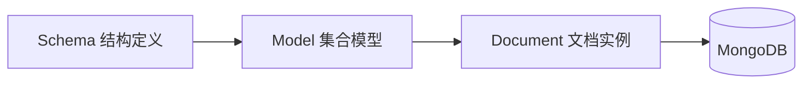

## 简介

Mongoose 是 MongoDB 在 Node.js 侧常用的 **ODM（Object Document Mapper）**，不是关系型库里的 ORM。它把集合文档映射为带 Schema 的 Model，便于校验、默认值与 CRUD。下文以 `Node + TypeScript` 为例。



## 连接数据库

```ts
import mongoose from 'mongoose';

async function connectToMongoDB() {
    await mongoose.connect('mongodb://localhost:27017/test');
    console.log('MongoDB Successfully Connected');
}

// 在应用启动时调用，并做好错误处理
connectToMongoDB().catch(console.error);
```

## 定义 Schema 与 Model

```ts
import mongoose from 'mongoose';

interface IUser {
    name: string;
    age: number;
    avatar?: string;
}

const userSchema = new mongoose.Schema<IUser>({
    name: {
        type: String,
        required: true
    },
    age: {
        type: Number,
        required: true
    },
    avatar: {
        type: String,
        default: ''
    }
});

// 模型名 'User' 默认对应集合 users（Mongoose 会做复数化）
const User = mongoose.model<IUser>('User', userSchema);
export default User;
```

## 使用模型（异步操作）

涉及查询的方法大多返回 Promise，**记得 `await`**（或 `.then`）。常用命名大致可记：

| 按 ID | 单条（多条命中时取第一条） | 多条 |
| ----- | -------------------------- | ---- |
| `xxxById` | `xxxOne` | `xxx` / `xxxMany` |

### 新增

```ts
const newUser = new User({
    name: 'AsMuin',
    age: 18
});
await newUser.save();

// 或
await User.create({ name: 'AsMuin', age: 18 });
```

### 查询

```ts
const selectedUser = await User.findById(userId);
const asMuin = await User.findOne({ name: 'AsMuin' });
const selectedUsers = await User.find({ age: 18 });

// 分页：skip + limit
const pageIndex = 2;
const pageSize = 10;
const users = await User.find()
    .skip((pageIndex - 1) * pageSize)
    .limit(pageSize);
```

更复杂条件可用查询构建器或原生 MongoDB 查询操作符；细节见官方 Query 文档。

### 更新、删除

```ts
// 默认返回【更新前】文档；需要新文档时传 { new: true }
const updated = await User.findByIdAndUpdate(
    userId,
    { name: 'AsMuin', age: 18 },
    { new: true }
);

await User.updateOne({ name: 'AsMuin' }, { age: 18 });

// 先查再改再存
const user = await User.findOne({ name: 'AsMuin' });
if (user) {
    user.name = 'AsMuin233';
    await user.save();
}

// 删除
const deleted = await User.findByIdAndDelete(userId);
```

## 注意点

- **ODM ≠ 自动事务**：多步写仍要自己设计事务或补偿（MongoDB 事务需副本集等前置条件）。
- 查询结果是 **Document** 时带 Mongoose 方法；只要纯 JSON 可用 `.lean()`。
- 连接失败、校验失败都要有错误处理，生产环境不要只 `console.log`。
