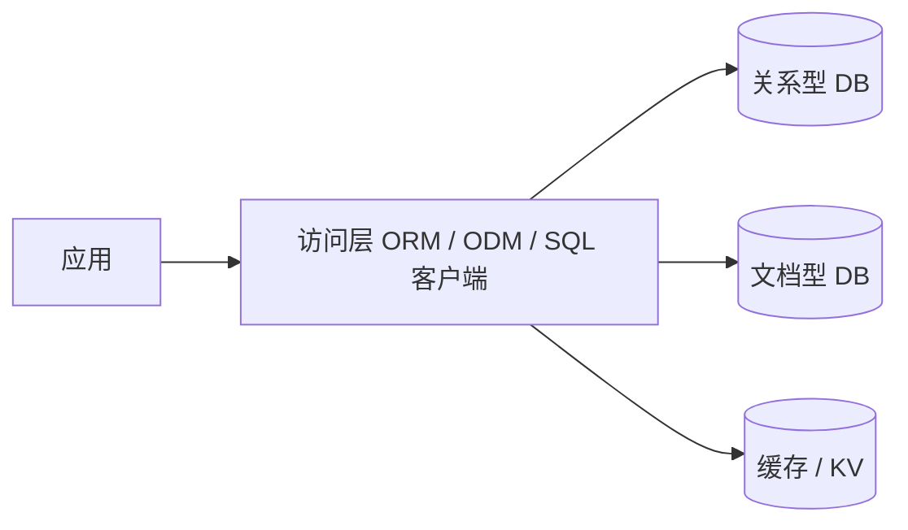

## 这章写什么

数据库是后端持久化的底座。选型时通常先问三件事：

1. **数据关系有多强？** 多表事务、强约束 → 更偏关系型（PostgreSQL / MySQL）。
2. **文档/半结构化是否占主导？** JSON 文档、字段易变 → 可考虑文档库（MongoDB）。
3. **一致性与扩展怎么权衡？** 强一致写入 vs 最终一致、读写扩展方式不同。

后续文档会分别展开：

| 文档 | 内容 |
| ---- | ---- |
| [锁与并发策略](/docs/backend/database/lock-strategies) | 事务边界、乐观/悲观锁、分布式锁分工 |
| [MongoDB 基础](/docs/backend/database/MongoDB/) | 文档模型、集合、与 SQL 概念对照 |
| [Mongoose](/docs/backend/database/MongoDB/Mongoose) | Node 侧 ODM 的 Schema / Model / CRUD |

## 常见分类（极简）

| 类型 | 代表 | 适合 |
| ---- | ---- | ---- |
| 关系型 | PostgreSQL、MySQL | 复杂查询、事务、规范化数据 |
| 文档型 | MongoDB | 文档结构、灵活字段、水平扩展场景 |
| 缓存 / KV | Redis | 会话、热点、限流、分布式锁等 |

## 选型口诀

- **钱、库存、权限、账务链路** → 优先关系型 + 清晰事务/锁策略。
- **内容、配置、日志型文档、多变 JSON** → 文档库往往更顺手。
- **热点读、短时状态** → Redis 等缓存，不要把缓存当唯一真相源（除非明确设计）。

更细的“何时开事务”可参考木屑笔记：[如何决策使用数据库事务](/sawdust/when-to-use-db-transactions)。
