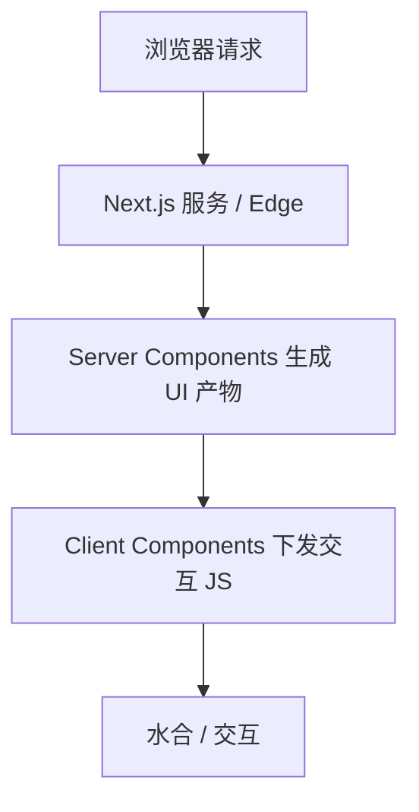

## 为什么需要它

纯 CSR（客户端渲染）的 SPA 常见痛点：

- 首屏 HTML 几乎只有挂载点，内容依赖后续 JS，**SEO 与首屏体验**承压
- 业务密钥、私密聚合逻辑若写进前端包会**直接暴露**（SSR/服务端组件能把敏感逻辑留在服务端；这不等于“数据天然更安全”，而是**执行位置**不同）

Next.js 在 React 上集成了路由、渲染模式与数据获取约定，是 React 全栈里非常流行的选择之一。

## 重要特点（App Router 视角）

- **文件系统路由**：`app/` 目录结构对应 URL，减少手写路由表
- **Server Components 默认**：能放服务端的逻辑尽量放服务端，需要交互再标 `'use client'`
- **多种渲染策略可组合**：SSR、SSG、ISR、Streaming 等（详见木屑 [前端渲染架构简记](/sawdust/frontend-rendering-architectures)）
- **数据获取可贴近服务端**：在 Server Component 里直接读库或调内部服务；也可继续消费已有后端 API

## 和“前后端分离 + 自建 SSR”的关系

| 方案 | 特点 |
| ---- | ---- |
| Next.js 全栈 | 路由、渲染、部署约定一体化，上手快 |
| React SPA + Nest 等自建 SSR | 保留现有 API 服务，对单页做 `renderToString` + hydrate（见随记混合 SSR 文） |

选型看团队栈与部署，而不是非此即彼。

## 注意

- 不要把 **RSC** 和 **SSR** 当成同义词
- 客户端包里仍然不要放密钥
- 缓存、动态渲染、路由段配置会显著影响行为，落地时对照当前版本文档
