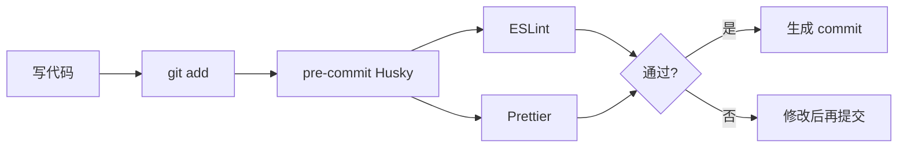

在编写代码时，我们往往需要 IDE 提示错误与风险。通过工具在写代码阶段发现问题，能提高质量与效率。

在团队协作里，**统一的静态检查与格式化**尤其重要。

## ESLint

ESLint 是 JavaScript / TypeScript 的静态分析工具，用来识别潜在错误与不良模式（变量未使用、React Hooks 依赖、不可达代码等）。规则可配置；不符合规则时会在 IDE 或 CI 中报错。

## Prettier

Prettier 专注**代码格式化**（换行、缩进、引号等），让风格一致，减少风格争论。

## ESLint 和 Prettier

| 工具 | 侧重点 |
| ---- | ------ |
| ESLint | 代码质量 / 潜在 bug / 框架最佳实践 |
| Prettier | 纯格式，几乎不判断业务逻辑对错 |

两者可一起用：Prettier 管长相，ESLint 管对错。若要把“格式是否符合 Prettier”也变成 ESLint 报错，可用 `eslint-config-prettier` / `eslint-plugin-prettier` 等组合避免规则打架。

## Husky + lint-staged

仅靠本地自觉不够。提交前用 Git Hooks 强制检查更稳：

- **Husky**：方便配置 `pre-commit`、`commit-msg`、`pre-push` 等钩子
- **lint-staged**（常见搭配）：只检查暂存文件，加快提交速度

这样能尽量保证进远程仓库的代码已经过格式与基础静态检查。
