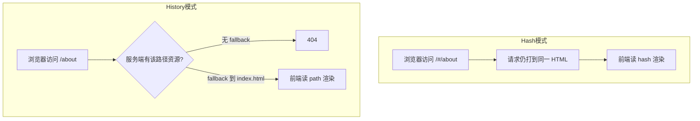

单页网页只有一个index.html，页面视图的切换通过JS逻辑实现。在HTML结构中有一个占位DOM元素负责承载切换的视图.可以理解为一个动态显示不同内容的DOM。

## SPA的实现基础

- 保证只有一个HTML页面，且用户交互时不会刷新和跳转页面。为SPA中的每个视图展示形式匹配一个特殊的URL。在浏览器的刷新、前进、回退都通过这个特殊的URL实现。

- 改变URL且不让浏览器向服务器发送请求。

- 同时可以监听的URL的变化

如今借助**location.hash**和**history.pushState**可以实现    *它们分别对应着如今路由模式中的--**Hash模式**--和--**History模式**--*

## Hash模式

### Hash是什么

  URL路径中可以存在**锚点**，通过一个符号 **#** 表示,当URL存在锚点的时候，锚点后面的字符串在请求时不会传给服务器，仅仅作为本地浏览器数据访问，这个值称为**`Hash`值**

#### Hash实现页面跳转

通过 `location.hash` 可以更改页面的 Hash，并且**不会刷新页面、只改变 URL**。Hash 改变时触发 `hashchange`，可据此切换视图。Hash 变化一般也会进入浏览历史，因此可用 `history.go()` 等控制前进后退。

## History模式

### History的发展

在`HTML5`前,`history`只能用于多页面的跳转。
而在`HTML5`的规范中，`history`新增了几个API

``` javascript
  history.pushState() //添加新的状态到历史状态栈
  history.replaceState() //用新的状态代替当前状态  
/**
@description: pushState / replaceState 是 History API 方法（不是“pushState 事件”）
@param: state  合法的 JS 对象，可在 popstate 时通过 history.state 取回
@param: title  现在大多数浏览器忽略，可用 null
@param: url    有效 URL，用于更新地址栏
*/

  history.state //返回当前的状态
  
```  

## History模式存在的问题

虽然在我们通过`history.pushState`和`history.replaceState`进行路由跳转更改`history.state`的时候不会触发页面刷新，但是当用户手动刷新又或者通过`URL`直接进入应用时,服务端是无法正确识别这个`URL`,因为在`SPA`单页应用只有一个`index.html`,`URL`地址出现变更在服务器是找不到资源的会出现`404`,所以需要在服务端进行默认配置,如`URL`匹配不到任何资源即默认指向单页应用的`HTML`文件也就是`index.html`。当然具体怎么设置根据需要进行决策。

## 两种模式的取舍



| | Hash | History |
| -- | ---- | ------- |
| 地址 | 带 `#` | 更接近多页路径 |
| 服务端 | 几乎不用特殊配置 | 刷新/直达需 fallback 到 `index.html` |
| SEO | 对传统爬虫不友好 | **URL 更友好，但纯 CSR 本身 SEO 仍然有限**，通常还要 SSR/预渲染 |

总结：不关心 SEO 的后台类应用用 Hash 往往更省心；To C 公网站点更常选 History，并配合 SSR/预渲染与服务端 fallback。

## 补充

- `Hash`模式下,通过`hashchange`事件监听`URL`变化,结合`DOM`操作去更新页面。
- `History`模式下,通过`popstate`事件来捕获`URL`的变化,并通过`pushState`去改变当前的`URL`同时保持页面不刷新。结合`DOM`操作去更新页面。
