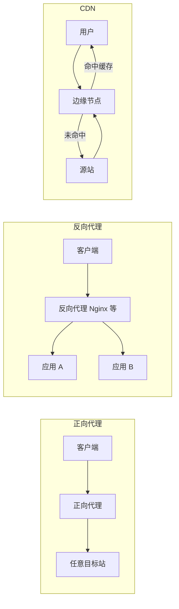

## CDN（内容分发网络）

`CDN` 的本质就是一个具有 `反向代理` 功能的 `内容缓存服务器`。

在没有 `CDN` 的参与下，我们访问一个网站的内容需要解析完 `IP 地址` 去直接访问 `源站服务器`。一般情况下这是没有问题的，但如果访问者距离 `源站服务器` 较远，尤其是一些跨国业务，会导致访问速度变慢。

针对这个问题，便出现了 `CDN`。`CDN` 边缘节点分布在各地，访问者可以就近访问距离近的 `CDN` 边缘节点，从而加快访问速度。

在这个过程中，访问者作为 `消费者`，`源站服务器` 作为 `商家`，而 `CDN` 则是 `快递仓库`：

1. 访问者请求内容
2. 若就近的 `CDN` 节点已缓存该内容，便直接返回，无需再连源站
3. 若没有缓存，则 **回源** 访问源站，把内容返回给访问者，并缓存到节点供后续使用

这样就能理解为什么说 `CDN` 是一个具有 `反向代理` 功能的 `内容缓存服务器`：

- 缓存命中时：直接返回给访问者
- 缓存未命中时：边缘节点 `反向代理` 该请求，代为访问源站获取内容并返回，同时写入缓存

对前端而言，CDN 还关系到：

- 带 hash 的静态资源如何长缓存
- HTML 入口为何通常不能长缓存
- 源站 `Cache-Control` 与 CDN 控制台规则如何配合
- 域名仍是业务域名时，请求为何会先打到边缘节点

更完整的说明见：[CDN 详解（前端视角）](./cdn)。

## 代理（proxy）

`代理` 处于 `客户端` 访问 `服务端` 的过程中，接收 `客户端` 的请求然后转发给 `服务端`，并接收 `服务端` 返回的响应再转发给 `客户端`。

即 `客户端` 仅与 `代理服务器` 通信，无需直接访问实际服务器地址——真正跟 `服务端` 建立连接的是 `代理服务器`。

### 正向代理（forward proxy）

`正向代理` 是为 `客户端` 提供代理服务的，即 `服务端` 不知道真正的 `客户端`；在请求过程中，`正向代理` 隐藏了 `客户端` 的身份。此时 `代理服务器` 代表 `客户端` 去通信。

主要用途：突破 `客户端` 的访问限制等。

### 反向代理（reverse proxy）

`反向代理` 是为 `服务端` 提供代理服务的，即 `客户端` 不知道真正的 `服务端`；在请求过程中，`反向代理` 隐藏了 `服务端` 的身份。此时 `代理服务器` 代表 `服务端` 去通信。

主要用途：服务器的 `负载均衡`、`安全防护` 等。

CDN 对外表现接近“站点侧的反向代理 + 缓存”：用户以为在访问业务站点，实际先连的是边缘节点；源站地址通常只写在 CDN 的 Origin 配置里。

