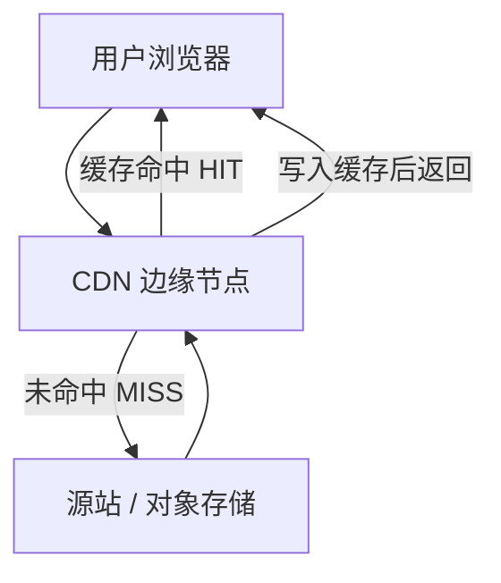

本文在 [CDN、代理简述](./cdn-proxy) 的基础上，从**前端交付**角度说明：CDN 解决什么问题、如何与构建产物配合、缓存该如何配置，以及“域名仍是业务域名时，请求为何会先走 CDN、何时才会回源”。

## 1. CDN 是什么、解决什么问题

**CDN（Content Delivery Network，内容分发网络）**可以理解成：

> 把网站要用的（主要是静态）资源，提前放到离用户更近的许多边缘节点上；用户就近获取，而不是每次都打回源站。

没有 CDN 时：

- 用户在 A 地，源站在 B 地（甚至跨国）
- 页面要加载 HTML、JS、CSS、图片、字体、视频
- 距离远 → RTT 高 → 首屏慢，弱网更差

有了 CDN 后：

1. 用户请求资源
2. DNS / 调度把请求导向**最近或最快的边缘节点**
3. 节点有缓存则直接返回；没有则**回源**，再把响应缓存起来
4. 后续附近用户可更快命中

| 价值     | 前端体感                   |
| -------- | -------------------------- |
| 更近     | 资源下载更快               |
| 更稳     | 源站抖动时，缓存仍可顶一阵 |
| 更省     | 源站带宽与 QPS 压力下降    |
| 更可扩展 | 大促、热点内容突发时更抗打 |

一句话：

> CDN 对前端的核心意义，不是“多了一个网盘”，而是把静态资源变成**可就近、可缓存、可大规模分发**的交付层。

它也从“加速图片的工具”，扩展成：

- 前端静态资源交付底座
- 性能优化基础设施
- 安全与流量入口（抗 DDoS、WAF、隐藏源站 IP）
- 边缘计算与体验个性化的前置层（Edge Functions、图片处理、A/B 等）



## 2. 前端最常上 CDN 的内容

前端场景里，CDN 主要承载**可缓存、可重复访问**的资源。

### 2.1 静态资源（最经典）

- JS / CSS 打包产物（如 `app.abc123.js`）
- 图片、SVG、WebP / AVIF
- 字体（`.woff2`）
- 音频、视频片段、HLS / DASH 分片
- 小程序 / App 中的静态包资源

### 2.2 前端构建产物

现代构建（Vite / Webpack / Rspack 等）通常产出：

- 带 **content hash** 的文件名，例如 `main.9f3a2b.js`
- 内容变了才换名 → CDN 可以**长期强缓存**
- HTML 往往短缓存或不缓存，用来“指向”最新那批 hashed 资源

### 2.3 第三方库 CDN（历史常见，现在更谨慎）

以前常见：

```html
<script src="https://cdn.jsdelivr.net/npm/vue@3/..."></script>
```

大型产品更倾向：

- 自己构建打包
- 或走**自有 CDN / 私有镜像**

原因：可控性、合规、版本锁定、供应链安全。

### 2.4 SSR / 边缘能力

CDN / 边缘平台还能：

- 缓存 HTML 或页面片段
- 跑边缘函数
- 做 A/B、鉴权前置、图片实时裁剪
- 做 ISR / 静态再验证

CDN 正在从“静态文件仓库”变成“靠近用户的应用边缘层”。

## 3. 前端为什么特别依赖 CDN

### 3.1 首屏与 Core Web Vitals

- **LCP**：大图、主 CSS、关键字体
- **FCP / TTFB**：HTML 与关键链路
- **INP**：主线程被大 JS 拖慢前，关键资源能否尽快可用

CDN 通过降低 RTT、提升吞吐、减少跨区域链路，直接改善这些指标。

### 3.2 “读多写少”适合缓存

- 用户打开页面：大量读 JS / CSS / 图片
- 发版：偶尔写一批新文件

这与 CDN 的缓存模型天然匹配。

### 3.3 用户分布不均

同一套前端会面对：

- 一线城市光纤
- 弱网环境
- 海外访问国内源站

多节点覆盖能把体验拉齐很多。

### 3.4 前后端分离的标配架构

```text
浏览器
  ├─ HTML / API  → 应用服务器 / BFF / Serverless
  └─ JS/CSS/图片/字体 → CDN
```

或更进一步：

```text
浏览器
  ├─ 可缓存页面 → CDN / 边缘
  ├─ API → 源站 / 网关
  └─ 媒体 → 专用媒体 CDN
```

## 4. 为什么“URL 还是业务域名”，却先走 CDN？

这是最容易卡住的点。浏览器里看到的是：

```text
https://www.example.com/assets/index-BrGHkFAK.js
```

直觉会以为：域名是自家的，所以一定直连源站机器。  
实际上，**对外访问名 ≠ 文件物理所在机房**。

### 4.1 先分清三个“地址”

| 名称                    | 例子                                    | 谁知道               |
| ----------------------- | --------------------------------------- | -------------------- |
| 对外 URL / 用户访问域名 | `https://www.example.com/assets/xxx.js` | 浏览器、用户         |
| CDN 边缘节点            | 厂商在各地的缓存机器                    | DNS 把域名解析到它们 |
| 源站 Origin             | `origin.example.com`、某台 ECS、OSS 桶  | 只有 CDN 配置里知道  |

> 用户始终访问同一个业务域名；CDN 在背后按需去源站拉文件，并决定自己能不能先回答。

接入前：

```text
www.example.com  →  A 记录 →  源站 IP
```

接入后（示意）：

```text
www.example.com  →  CNAME →  xxx.cdn-vendor.com
xxx.cdn-vendor.com   →  附近 CDN 节点 IP
```

于是：

1. 浏览器仍请求 `https://www.example.com/...`
2. DNS 却让它连**附近的 CDN IP**
3. TLS 通常由 CDN 对外终止
4. CDN 查缓存 / 规则
5. 没有才按 Origin 配置回源

**URL 没变，连接目标变了。** 前端一般不必把资源写成某个节点的专属域名。

### 4.2 和本地浏览器缓存的关系

实际常常是两层：

```text
浏览器缓存 → CDN 边缘缓存 → 源站
```

强刷有时只绕过浏览器缓存，请求仍可能在 CDN 上 HIT。  
要靠 `Age`、`cf-cache-status`、`x-cache` 等响应头分辨卡在哪一层。

## 5. CDN 如何实现“缓存源站文件”

CDN 缓存的本质不是挂载源站磁盘，而是 **HTTP 反向代理 + 分布式缓存**：

> 在靠近用户的边缘节点上，按“缓存键”存一份源站响应的副本；下次同样请求先查本地，命中就直接返回，未命中再回源并决定是否写入。

### 5.1 一次请求怎么走

以：

`https://www.example.com/assets/index-BrGHkFAK.js`

为例：

```text
浏览器
  │ 1. DNS 解析到附近 CDN，而不是源站
  ▼
CDN 边缘节点
  │ 2. 计算 Cache Key
  │ 3. 查本地 / 本区域缓存
  │
  ├─ HIT → 直接返回缓存 + 缓存状态头
  │
  └─ MISS
        │ 4. 回源（Express / Nginx / OSS …）
        ▼
      源站返回文件 + Cache-Control 等头
        │ 5. CDN 判断：能否缓存？TTL 多久？
        │ 6. 可缓存则写入，再返回用户
```

边缘节点存的不只是正文，还包括：

| 存的东西 | 例子                                                    |
| -------- | ------------------------------------------------------- |
| 缓存键   | `www.example.com` + `GET` + `/assets/index-BrGHkFAK.js` |
| 状态码   | `200`                                                   |
| 响应体   | JS / CSS / 图片字节                                     |
| 响应头   | `Content-Type`、`Cache-Control`、`ETag`…                |
| 过期时间 | `now + TTL`                                             |

所以它是“按 HTTP 响应做的分布式缓存”，不是源站目录的实时镜像。  
**源站文件变了，CDN 不会自动知道**，除非过期、校验、刷新，或 URL 变了。

### 5.2 核心概念

#### Cache Key（缓存键）

常见默认大致是：

```text
scheme + host + path + query
```

因此：

- `/assets/app.js`
- `/assets/app.js?v=1`

可能被当成两份缓存。

带 hash 后：

- `/assets/index-BrGHkFAK.js`
- `/assets/index-NEWhash.js`

本来就是两个键，各自可以长缓存。

#### TTL（存活时间）

来源通常有两层：

1. **源站头**：`Cache-Control: max-age=...` / `s-maxage=...`
2. **CDN 控制台强制规则**：按路径写死 0 秒 / 1 年

很多厂商优先级心智模型是：

```text
CDN 强制规则 > 源站 Cache-Control / Expires > CDN 默认时间
```

（以具体厂商文档为准。）

#### HIT / MISS / EXPIRED / BYPASS

| 状态             | 含义                         |
| ---------------- | ---------------------------- |
| HIT              | 边缘有可用缓存，直接返回     |
| MISS             | 没有，已回源，通常尝试写入   |
| EXPIRED / STALE  | 有但过期，可能回源校验或重拉 |
| BYPASS / DYNAMIC | 规则规定不缓存，直接回源     |

#### 回源、刷新、预热

- **回源**：未命中或不缓存时，CDN 去 Origin 拉
- **刷新（purge / invalidation）**：删掉或标记失效某 URL / 目录缓存
- **预热（prefetch）**：提前让节点去源站拉并缓存

对 hash 资源，日常发版通常**不必 purge assets**；更常处理的是 `index.html` 与无 hash 公共文件。

### 5.3 “必要时刻”如何拿到最新数据

CDN 不是一旦缓存就永远断根源站。以下情况会再次访问源站，或至少问源站：

| 情况                               | 行为                                               |
| ---------------------------------- | -------------------------------------------------- |
| 缓存未命中（MISS）                 | 回源拉完整响应                                     |
| TTL 过期                           | 重拉全文，或带 `ETag` / `Last-Modified` 做条件校验 |
| 规则不缓存（BYPASS）               | 每次回源，CDN 只做转发 / 防护 / TLS                |
| 手动刷新                           | 下一次强制 MISS                                    |
| URL 变了（新 hash）                | 新 cache key，旧缓存可自然过期                     |
| 源站返回 `no-store` / `private` 等 | 共享缓存通常不该长存                               |

关于常见头：

- **`no-cache`**：不是“不准存”，更准确是“用之前先校验”
- **`no-store`**：更偏向不要存
- **`max-age=31536000, immutable`**：有效期内直接用，别怀疑
- **条件请求**：CDN 带 `If-None-Match` / `If-Modified-Since`  
  - 源站 `304`：继续用旧缓存并续期  
  - 源站 `200`：替换为新响应

### 5.4 闭环心智模型

```text
1. 用户访问业务域名 URL
2. DNS 把域名指向 CDN，不直连源站
3. CDN 用 cache key 查本地：
   - 有且未过期且允许直接用 → HIT
   - 有但需要 revalidate → 带条件问源站（304 / 200）
   - 没有 / 不缓存 / 已 purge → 回源取最新
4. 源站只在“CDN 需要时”被访问
5. CDN 按策略决定：存不存、存多久、下次能否直接用
```

## 6. 配置 CDN 缓存：不能只靠前端 hash

这里常被混成一件事的其实是两件：

1. **前端打包给文件名加 hash**  
   只解决：“内容变了，URL 也会变，所以敢长缓存。”
2. **源站响应头 + CDN 规则**  
   才真正决定“缓存多久、能不能缓存。”

可以记成：

> **hash = 让长缓存变得安全**  
> **Cache-Control / CDN 规则 = 真正打开长缓存**

### 6.1 三处配置分别干什么

| 层级     | 做什么                          | 配在哪里                   |
| -------- | ------------------------------- | -------------------------- |
| 前端构建 | 产出 `app-BrGHkFAK.js` 这种名字 | Vite / Webpack 等          |
| 源站     | 返回 `Cache-Control` 等头       | Nginx / Express / OSS / S3 |
| CDN      | 按路径或源站头决定边缘 TTL      | 云厂商控制台 / IaC         |
| 浏览器   | 按响应头决定本地是否复用        | 通常不用额外配置           |

只做 hash、不做后面两层时，常见问题：

| 只做了 hash            | 实际可能发生                |
| ---------------------- | --------------------------- |
| 前端文件名变了         | CDN 仍用默认策略长缓存 HTML |
| 没设 assets 长缓存     | 大 JS 反复回源，又慢又贵    |
| HTML 被缓存太久        | 发版后用户仍看旧页面        |
| API 被误缓存           | 串数据 / 旧数据             |
| 分享图无 hash 却长缓存 | 更新图长期不生效            |

### 6.2 针对典型构建产物的路径策略

假设构建后 HTML 类似：

```html
<script type="module" crossorigin src="/assets/index-BrGHkFAK.js"></script>
<link rel="stylesheet" crossorigin href="/assets/index-BS9Jjnnm.css" />
<link rel="icon" href="/favicon.ico" />
<meta property="og:image" content="https://www.example.com/share_preview.png" />
```

这是典型的 **入口 HTML + `/assets/*` 带 hash 资源 + 少量无 hash 公共文件**。

| 路径                                                 | 是否带 hash | 建议缓存                              | 说明           |
| ---------------------------------------------------- | ----------- | ------------------------------------- | -------------- |
| `/`、`/index.html`、SPA 回退 HTML                    | 否          | `no-cache` 或很短 / `no-store`        | 发版开关       |
| `/assets/**`                                         | 是          | `public, max-age=31536000, immutable` | 主加速区       |
| `/favicon.ico`、`/logo512.png`、`/share_preview.png` | 否          | `1h ~ 1d`，或改成带版本号             | 更新时易踩缓存 |
| `/api/**`                                            | -           | 通常不缓存或私有短缓存                | 避免串数据     |

核心原则：

> **HTML 负责“随时能换新版本”，带 hash 的 `/assets/*` 负责“尽量永远用缓存”。**

### 6.3 推荐响应头

**HTML：**

```http
Cache-Control: no-cache
Content-Type: text/html; charset=utf-8
```

对发版极度敏感，或 HTML 使用动态 CSP `nonce` 时，可用 `no-store` 或极短 `max-age`。

各指令的语义差异、以及 `public, max-age=0` 与 `no-store` 如何选择，见 [第 7 节](#7-cache-control-响应头策略)。

**`/assets/*`：**

```http
Cache-Control: public, max-age=31536000, immutable
```

**无 hash 公共文件：**

```http
Cache-Control: public, max-age=86400
```

更稳妥的做法是把分享图等改成带 hash / 版本号的路径，再拉长缓存。  
`og:image` 建议使用**绝对 URL**。

### 6.4 两种落地方式（二选一即可）

#### 方式 A：源站主导（推荐）

源站把头设对，CDN 选择**遵循源站**。

Express 示意：

```js
app.use(
  "/assets",
  express.static("dist/assets", {
    setHeaders(res) {
      res.setHeader(
        "Cache-Control",
        "public, max-age=31536000, immutable",
      );
    },
  }),
);

app.get("*", (req, res) => {
  res.setHeader("Cache-Control", "no-cache");
  // 如有 CSP，也加在 HTML 响应上
  res.sendFile(path.join(__dirname, "dist/index.html"));
});
```

优点：语义集中在应用，换 CDN 厂商也容易。

#### 方式 B：CDN 按路径强制覆盖

即使源站头不完美，也在 CDN 写死：

- `/assets/*` → TTL = 31536000
- `/`、`*.html` → TTL = 0
- `/api/*` → 不缓存

优点：见效快。  
缺点：源站和 CDN 两套规则，后期容易忘记、互相打架。

**最省心组合：**

1. 源站 `Cache-Control` 设正确
2. CDN 遵循源站
3. 再加保底：HTML 不长缓存，`/assets/*` 长缓存

### 6.5 发版顺序

1. 先上传新 `/assets/*`（新 hash 文件）
2. 再发布 / 覆盖新 `index.html`
3. 若 HTML 可能被错误缓存，**只刷新 HTML**
4. 用户拿新 HTML → 请求新 hash → 首次 MISS → 之后 HIT

旧 hash 文件可以留着自然过期，不必靠“覆盖同名 `app.js` + 全网 purge”发版。

```text
前端构建
  └─ index.html + /assets/*-hash.js
        │
        ▼
源站（Express / Nginx / OSS）
  ├─ HTML: no-cache
  └─ /assets/*: max-age=31536000, immutable
        │
        ▼
CDN
  ├─ 建议：遵循源站
  ├─ 保底：HTML 不缓存 / 短缓存
  └─ 保底：/assets/* 长缓存
        │
        ▼
浏览器
```

## 7. `Cache-Control` 响应头策略

前面多处直接给了推荐值。这一节把常见指令拆开，方便做决策——尤其是 HTML / API 上经常混淆的：

- `no-cache`
- `no-store`
- `public, max-age=0`
- `max-age=0, must-revalidate`

### 7.1 它在对谁说话

`Cache-Control` 同时约束（或提示）多层缓存，但语义重心不同：

| 角色 | 典型例子 | 更关心什么 |
| --- | --- | --- |
| 私有缓存 | 浏览器 | 能不能本地复用、要不要先校验 |
| 共享缓存 | CDN、公司代理 | 能不能给**不同用户**复用同一份副本 |

所以写头时要先问两句：

1. **这份响应能不能被别人共用？** → `public` / `private`
2. **多久内可以直接用，过期后怎么办？** → `max-age` / `s-maxage` / `no-cache` / `no-store` / `must-revalidate`

> CDN 控制台仍可能“强制覆盖”源站头。  
> 下面讨论的是 **HTTP 语义本身**；生产上仍建议源站语义正确 + CDN 不乱覆盖。

### 7.2 常用指令速查

| 指令 | 含义（实用理解） |
| --- | --- |
| `public` | 明确允许共享缓存（CDN）存储 |
| `private` | 只允许浏览器等私有缓存；**不要**当作公共 CDN 长缓存 |
| `max-age=N` | 从响应被生成/收到起，N 秒内可认为新鲜，可直接用 |
| `s-maxage=N` | 只给**共享缓存**用的新鲜时间；优先于 `max-age`（对 CDN 很有用） |
| `no-cache` | **可以存**，但用之前必须向源站/上游做新鲜度校验（常靠协商缓存） |
| `no-store` | **尽量别存**完整响应（含不落盘、不进共享缓存的意图更强） |
| `must-revalidate` | 一旦过期，在成功校验前**不能**直接拿陈旧副本凑合 |
| `proxy-revalidate` | 类似 `must-revalidate`，主要约束共享缓存 |
| `immutable` | 在新鲜期内别做无意义的再验证（适合带 content hash 的 URL） |
| `stale-while-revalidate=N` | 过期后的 N 秒内可先返回旧的，同时后台再验证 |
| `stale-if-error=N` | 源站出错时，过期后的 N 秒内仍可返回旧的 |

补充：

- 历史头 `Expires`、`Pragma: no-cache` 仍可见，现代优先把语义写在 `Cache-Control`
- 和 `ETag` / `Last-Modified` 搭配时，校验常表现为带条件请求，源站回 `304 Not Modified`

### 7.3 最容易混的一组：`no-store` vs `no-cache` vs `max-age=0`

先给结论，再展开：

| 写法 | 能不能先存一份 | 再次使用前要怎样 | 典型用途 |
| --- | --- | --- | --- |
| `no-store` | 意图上尽量不存 | 几乎每次都重新拉全文 | 极敏感、或绝不能复用的响应 |
| `no-cache` | 可以存 | 每次用前先校验（可能 `304`） | HTML 入口、需要尽快看见新版本 |
| `max-age=0` | 可以存，但立刻算过期 | 用前通常要再验证 | 与 `no-cache` 接近，细节看是否还带其它指令 |
| `max-age=0, must-revalidate` | 可以存 | 过期后必须成功验证，不能裸用 stale | 比“随缘用旧副本”更严格 |
| `public, max-age=0` | 允许 CDN/浏览器存 | 共享/私有侧都把新鲜时间视为 0，用前再谈校验 | “允许缓存基础设施介入，但不直接当新鲜内容用” |

#### `no-cache` 不是 “No Cache”

名字有误导性。更准确的理解是：

> **不要在未校验的情况下直接用缓存。**

流程常是：

```text
浏览器/CDN 可能已有副本
  → 发条件请求（If-None-Match / If-Modified-Since）
  → 源站 304：继续用旧正文，省流量
  → 源站 200：换新正文
```

所以 HTML 用 `no-cache` 很常见：发版后能较快切到新入口，同时未变更时还能吃到 `304`。

#### `no-store` 更强

意图是：

> **别把这份响应放进可复用的缓存里。**

更适合：

- 含敏感信息的页面/接口
- 每次必须是全新动态结果
- 使用 **per-request CSP nonce** 的 HTML（公共缓存一份会串 nonce/策略）
- 明确不想让 CDN 留副本

代价：

- 更难吃到 `304` 与边缘 HIT
- 源站与带宽压力更大
- 体感上往往更慢、更贵

注意：现实中某些中间层对 `no-store` 的执行严格程度并不完全一致；**安全敏感数据仍应以“响应本身不包含不必要机密 + 正确鉴权”为主**，头是重要防护层，但不是唯一保障。

#### `max-age=0` 更像 “立刻过期”

`max-age=0` 表示：收到时就已经不新鲜了。  
下一步通常进入“过期后如何处理”的规则，而不是“禁止存储”。

因此：

- 单独写 `max-age=0`，缓存仍可能保存响应，并在使用前 revalidate
- 若还希望过期后绝不能擅自用旧副本，应配合 `must-revalidate` 等

### 7.4 重点对比：`public, max-age=0` vs `no-store`

这是做 HTML / 网关配置时很常见的分岔。

#### A. `Cache-Control: public, max-age=0`

含义拆开：

- `public`：允许共享缓存持有
- `max-age=0`：没有任何“可直接当新鲜内容用”的时间窗

实际效果更接近：

```text
CDN / 浏览器可以保留副本
但每次（或按实现）使用前应回源校验
未变化 → 304
已变化 → 200 新内容
```

**更适合：**

- 希望 HTML 尽快更新，但还想保留协商缓存收益
- 希望 CDN 仍作为统一入口（TLS、防护、回源收敛），而不是完全“无状态直穿”
- 源站能稳定提供 `ETag` / `Last-Modified`

**不太适合：**

- 响应含用户个性化私密数据却还写了 `public`（应用 `private`）
- 每次正文都不同且校验没有意义（例如强动态 nonce 正文）
- 业务要求“任何中间层都不要留副本”

#### B. `Cache-Control: no-store`

含义：

```text
请不要存储这份响应供以后复用
下次再来，倾向于重新获取完整响应
```

**更适合：**

- 登录态下的敏感 HTML / 接口
- 带一次性 `nonce` 的文档响应
- 合规要求尽可能不落缓存
- 你无法信任中间层会正确做 revalidate

**代价：**

- CDN 缓存加速收益接近于 0（还可能保留代理/防护价值）
- 源站压力更大
- 很难靠 `304` 省流量

#### C. 决策表

| 问题 | 偏 `public, max-age=0`（或 `no-cache`） | 偏 `no-store` |
| --- | --- | --- |
| 内容是否可被不同用户共享？ | 是（例如同一份公开 SPA HTML） | 否，或哪怕误共享风险也不可接受 |
| 未变更时，能否接受 `304`？ | 希望接受 | 无所谓，宁可每次 200 |
| 是否有 CSP nonce / Set-Cookie 个性化文档？ | 通常不 | 常常是 |
| 是否极致敏感？ | 否 | 是 |
| 是否仍希望 CDN 有“可缓存对象”的处理路径？ | 是 | 否，宁可 BYPASS |

经验规则：

1. **公开 SPA 的 `index.html`**：优先 `no-cache` 或 `max-age=0, must-revalidate`；需要明确允许共享缓存时，可用 `public` 搭配它们。  
2. **带 per-request nonce / 私密信息的 HTML**：优先 `no-store` 或至少 `private, no-cache`，并避免 CDN 公共长缓存。  
3. **不要用 `public` 去标记个性化响应。**  
4. **`max-age=0` 不是 `no-store` 的同义词**——前者管新鲜度，后者管是否存储。

### 7.5 `no-cache` 和 `max-age=0, must-revalidate` 怎么选

两者都很常见，实务上常接近：

| 写法 | 细微差别（实用向） |
| --- | --- |
| `no-cache` | 强调：用前先校验 |
| `max-age=0, must-revalidate` | 强调：新鲜时间为 0；过期后必须校验成功才能用 |

对现代浏览器，公开 HTML 入口两者通常都能达到“尽量别直接用旧 HTML”的目标。  
若还要区分 CDN 与浏览器：

```http
Cache-Control: public, max-age=0, s-maxage=0, must-revalidate
```

或更常见、好读：

```http
Cache-Control: no-cache
```

若希望浏览器稍缓存极短时间、CDN 不长缓存，可用：

```http
Cache-Control: public, max-age=60, s-maxage=0, must-revalidate
```

含义：

- 浏览器 60 秒内可直接复用
- 共享缓存（CDN）视为立刻需要按共享规则处理（不把它当 60 秒公共新鲜副本）

具体 CDN 是否严格尊重 `s-maxage`，仍以厂商为准。

### 7.6 前端场景下的推荐组合

#### 1）带 hash 的静态资源（主路径）

```http
Cache-Control: public, max-age=31536000, immutable
```

- `public`：CDN 可存
- `max-age=1y`：长期新鲜
- `immutable`：文件名不变就别反复怀疑它变了

前提：文件名含 content hash，内容变则 URL 变。

#### 2）公开 SPA / 站点 HTML 入口

默认推荐：

```http
Cache-Control: no-cache
```

可接受等价思路：

```http
Cache-Control: public, max-age=0, must-revalidate
```

若发版极度敏感、或 HTML 含动态 nonce：

```http
Cache-Control: no-store
```

#### 3）无 hash 的公共图片 / favicon / 分享图

```http
Cache-Control: public, max-age=86400
```

需要更平滑时可考虑：

```http
Cache-Control: public, max-age=3600, stale-while-revalidate=86400
```

更好的长期做法：文件名带版本号或 hash，再提高 `max-age`。

#### 4）公开且可缓存的 API（少数）

```http
Cache-Control: public, max-age=60, s-maxage=30
```

并仔细处理：

- 缓存键是否包含 query
- 是否误缓存了 `Authorization` 个性化结果
- 需要时用 `Vary`

#### 5）用户 API / 鉴权接口

常见：

```http
Cache-Control: no-store
```

或：

```http
Cache-Control: private, no-cache
```

原则：**默认不要让 CDN 公共缓存 API。**  
只有真正“所有人同一份”的响应，才考虑受控的短公共缓存。

#### 6）错误页 / 特殊状态码

不要假设 CDN 会像缓存 `200` 一样缓存所有状态码。  
若错误响应被长缓存，可能造成“全站一起挂”的假象。  
错误响应通常应短 TTL 或不缓存，并在 CDN 侧单独确认策略。

### 7.7 和协商缓存的配合

只写 `no-cache` / `max-age=0` 还不够“省”，最好让源站具备校验能力：

```http
ETag: "abc123"
# 或
Last-Modified: Tue, 29 Jul 2026 02:00:00 GMT
```

请求侧：

```http
If-None-Match: "abc123"
If-Modified-Since: Tue, 29 Jul 2026 02:00:00 GMT
```

结果：

- 没变：`304`，正文不重传
- 变了：`200` + 新正文 + 新校验信息

这对 HTML 特别有价值：

- 既避免“长缓存导致发版不生效”
- 又避免“每次完整下载整份 HTML”

带 `immutable` 的 hash 资源则几乎不依赖这种频繁校验。

### 7.8 决策树（可直接套）

```text
这是带 content hash 的 JS/CSS/图片/字体吗？
  └─ 是 → public, max-age=31536000, immutable

这是用户私密 / 鉴权 API / 含敏感信息吗？
  └─ 是 → no-store（或 private, no-cache），CDN 不公共长缓存

这是公开 HTML 入口吗？
  ├─ 含 per-request nonce / 强个性化 → no-store 或 private + 禁止共享长缓存
  └─ 普通公开 SPA HTML
        ├─ 想尽快更新且可接受 304 → no-cache
        │     或 public, max-age=0, must-revalidate
        └─ 想绝对不留副本 → no-store

这是无 hash 公共静态文件吗？
  └─ 短到中等 max-age；或改名后再长缓存

这是公开可共享 API 吗？
  └─ 明确短 max-age / s-maxage，并设计好缓存键与 Vary
```

### 7.9 常见误配

1. **HTML 也套了 `immutable` 或一年 `max-age`**  
   发版只能靠 purge 救命。
2. **把 `no-cache` 理解成“一定不走 CDN”**  
   CDN 仍可能持有并每次校验；要“别存”，用 `no-store` 或 CDN bypass。
3. **`public` + 个性化响应**  
   有串用户数据风险。
4. **只在 CDN 控制台写 TTL，源站乱输出头**  
   换厂商或直连源站时行为漂移。
5. **API 与 `/assets/*` 共用一条长缓存规则**  
   最危险的一类配置。
6. **以为 `max-age=0` 等于禁用一切缓存**  
   它更像“立即过期”，不是 `no-store`。

### 7.10 和小节 6 的衔接

- 第 6 节回答：**按路径该怎么配**
- 本节回答：**每个 `Cache-Control` 选项到底意味着什么、如何二选一**

落地时建议两者一起看：先选路径策略，再用本节核对头语义是否真的表达了那个策略。

## 8. 用具体厂商理解“缓存是怎么配出来的”

不同厂商名词不同，机制相通。

### 8.1 Cloudflare

```text
用户 → Cloudflare 边缘 → 源站
```

常见做法：

1. 源站先出对 `Cache-Control`
2. Cache Rules：
   - `/assets/*` → Eligible for cache，长 Edge TTL 或 Respect origin
   - `/`、`*.html` → Bypass cache
3. 验证响应头：`cf-cache-status: HIT | MISS | DYNAMIC | EXPIRED`

### 8.2 AWS CloudFront

核心是 **Distribution + Behavior（按路径）+ Cache Policy**。

| Path Pattern | Origin      | Cache Policy 思路                    |
| ------------ | ----------- | ------------------------------------ |
| `/assets/*`  | S3 或应用源 | 长 TTL；不要把 Cookie 放进 cache key |
| `/api/*`     | 应用源      | CachingDisabled                      |
| 默认 `*`     | 应用源      | 不缓存或尊重 HTML 的 `no-cache`      |

S3 场景很常见：

1. CI 上传时给对象写 metadata：
   - assets：`Cache-Control: public, max-age=31536000, immutable`
   - `index.html`：`Cache-Control: no-cache`
2. CloudFront 使用 origin cache headers
3. 需要时只 invalidation HTML

验证：`x-cache: Hit from cloudfront` / `Miss from cloudfront`

### 8.3 阿里云 CDN（腾讯云 / 华为云类似）

常见配置点：

1. 源站信息：域名 / IP、回源 HOST、回源协议
2. 缓存过期时间（按目录、后缀匹配，注意优先级）
3. 遵循源站 or 强制 CDN TTL
4. 参数过滤（无意义 query 是否参与 cache key）
5. 刷新 / 预热

示例规则：

| 类型               | 对象       | 过期时间      |
| ------------------ | ---------- | ------------- |
| 目录               | `/assets/` | 365 天        |
| 后缀               | `.html`    | 0 秒          |
| 目录               | `/api/`    | 0 秒          |
| 无 hash 图片 / ico | 具体路径   | 1 小时 ~ 1 天 |

验证时常看 `X-Cache`、`Via`、`Age` 等头。

### 8.4 让 assets 稳定 HIT 通常要满足

1. 方法是 GET / HEAD
2. 状态码适合缓存（常见 200；其它状态码要小心）
3. 规则允许缓存
4. TTL > 0
5. cache key 稳定（别把 Cookie、乱 header、随机 query 算进去）
6. 响应不是 `private` / `no-store` 这类不宜共享长缓存的语义
7. 用 hash URL 固定内容，而不是覆盖同名文件硬更新

前端 hash 主要帮助第 7 点；厂商配置 + 源站头解决 3–6 点。

## 9. CDN 与 CSP、Express 静态托管

用 Express 接管静态文件，多半是为了统一加响应头（包括 CSP）。  
这**不意味着**静态资源必须只能从 Express 直出、不能再走 CDN。

|          | CDN                      | CSP                         |
| -------- | ------------------------ | --------------------------- |
| 主要问题 | 近、快、省带宽、抗流量   | 限制资源来源，降低 XSS 危害 |
| 作用层   | 分发与缓存               | 浏览器安全策略              |
| 典型对象 | JS / CSS / 图片 / 字体等 | 主要是 **HTML 文档响应**    |

> CSP 不是 CDN 的替代品，也不是互斥品。

### 9.1 常见误区

“为了 CSP 把所有静态都收回 Express”，往往会把 CDN 收益一起丢掉，而且通常不必要。

更干净的分工：

- **HTML（入口）**：应用服务器动态产出，带 CSP
- **带 hash 的静态资源**：对象存储 + CDN，长期缓存

即便静态仍由 Express 提供，前面也可以挂 CDN：

```text
用户 → CDN → Express（源站：HTML + 静态 + 各类响应头）
```

### 9.2 CSP 模式对缓存的影响

#### A. 静态白名单 CSP —— 与 CDN 很合得来

```http
Content-Security-Policy: default-src 'self'; script-src 'self' https://cdn.example.com; object-src 'none'
```

HTML 短缓存，assets 长缓存，非常标准。

#### B. `nonce` 动态 CSP —— 限制的是 HTML 共享长缓存

每次请求 nonce 不同时：

- HTML **不能**对所有用户做共享长缓存
- JS / CSS / 图片**仍然可以**走 CDN
- 常见：HTML 回源或边缘动态生成，静态资源仍 CDN

#### C. `hash` 型 CSP（`script-src 'sha256-...'`）

- 对内联脚本友好
- 外部脚本文件仍可放 CDN

### 9.3 推荐落法

**方案 1：最佳默认**

```text
CDN：/assets/*（hash 文件，长缓存）
应用：/ 与 HTML 入口（CSP、cookie、鉴权相关）
```

**方案 2：Express 托管静态，但前面加 CDN**

按路径设好 `Cache-Control`，CDN 遵循源站；注意 nonce HTML 不可被公共长缓存。

**方案 3：开发 Express 管静态，生产 OSS / CDN**

很多生产架构的最终态。

若将来静态资源与页面**不同域**，且 HTML 里写了 `crossorigin`，CDN 需正确配置 CORS；同域一般更简单。

## 10. 工程化配合与常见坑

### 10.1 域名与跨域

常把静态资源放到独立域名，例如：

- `static.example.com`
- `cdn.example.com`

好处：

- 与主站 Cookie 隔离
- 方便单独配缓存、HTTPS、CORS
- 便于分流与统计

注意：

- 字体等跨域资源需要正确 CORS
- HTTP/2、HTTP/3 后，过度“多域名拆分”收益下降

### 10.2 现代传输与压缩

接入 CDN 常顺带获得：

- 全站 HTTPS
- HTTP/2 多路复用
- HTTP/3 / QUIC（弱网更友好）
- Brotli / Gzip
- 智能图片格式转换

### 10.3 进阶能力

- 安全：抗 DDoS、WAF、Bot 管理、隐藏源站
- 图片 / 媒体处理：按宽裁剪、自动格式、视频分发
- 边缘计算：按地区返回配置、登录跳转、A/B、拼装片段
- 配置下发：灰度、功能开关、远程文案 / 主题包

### 10.4 前端常见坑

1. **缓存没刷新**：发了版用户还是旧 JS → 多半是 HTML 也被长缓存，或文件名没 hash
2. **只更新了 JS，HTML 还指着旧文件**：白屏 / 报错
3. **CORS / 字体加载失败**
4. **混用多个公共 CDN**：稳定性、隐私、可用性不可控；SRI 要配好
5. **把个性化 API 结果做成公共缓存**：可能串数据
6. **开发与生产 publicPath / assetPrefix 不一致**：生产 404
7. **无 hash 分享图长缓存**：社交平台预览长期不更新

## 11. 如何验证 CDN 是否按预期工作

打开 DevTools → Network，点某个 JS / CSS，看响应头：

```http
cache-control: public, max-age=31536000, immutable
cf-cache-status: HIT
# 或
x-cache: Hit from cloudfront
age: 84321
```

解释：

- `cache-control`：策略语义
- `cf-cache-status` / `x-cache`：这次有没有走边缘缓存
- `age`：这份缓存已经存在多久（秒）

同一文件连续访问两次：

- 第一次可能 `MISS`
- 第二次同节点常变 `HIT`

发版后还应确认：

1. HTML 已换成新内容
2. HTML 引用的是新的 hash URL
3. 新 assets 首次可 200，随后命中缓存
4. 旧 assets 即使仍 HIT 也没关系，只要没人引用

## 12. 最小清单（先做到这几条就够）

1. **前端**：`/assets/*` 文件名带 content hash
2. **源站或 CDN**：`/assets/*` 长缓存（建议 1 年 + `immutable`）
3. **源站或 CDN**：HTML 不长缓存（`no-cache` / `no-store` / 很短 TTL）
4. **API**：默认不走公共长缓存
5. **发版**：先上传新 assets，再切换 HTML；必要时只刷新 HTML
6. **验证**：看 `Cache-Control` 与厂商缓存命中头

先不用一次学完所有高级项（复杂 Vary、多层 CDN、各种 cache key 算法）。主路径通了再加。

## 13. 总结

| 问题                    | 简答                                                 |
| ----------------------- | ---------------------------------------------------- |
| CDN 是什么              | 靠近用户的反向代理 + 内容缓存网络                    |
| 前端为什么需要它        | 让静态资源更快、更稳、更省、更抗流量                 |
| 为什么 URL 仍是业务域名 | DNS 把域名指到 CDN；源站地址藏在 Origin 配置里       |
| 如何缓存源站文件        | 回源拿到 HTTP 响应后，按 cache key 与 TTL 存边缘副本 |
| 如何保证必要时刻是新的  | 过期、校验、BYPASS、purge、或换 hash URL             |
| 只做前端 hash 够不够    | 不够；还要源站头和/或 CDN 规则                       |
| 和 CSP 冲突吗           | 不冲突；CSP 多半加在 HTML，assets 仍可 CDN           |
| `no-cache` 和 `no-store` 一样吗 | 不一样：前者可存但用前校验，后者尽量不存     |
| `public, max-age=0` 等于禁用缓存吗 | 不等于：允许存储，但新鲜时间为 0，通常需 revalidate |

相关阅读：

- [CDN、代理简述](./cdn-proxy)
- [浏览器网络资源访问](./network-communication)
- [常见网络协议](./common-network-protocols)
