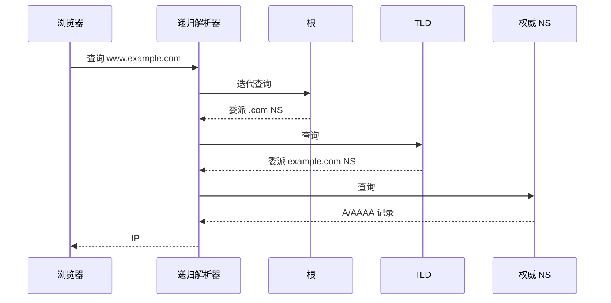

以一个简单的例子来说明浏览器网络资源访问的过程。
假设我们访问一个地址，输入它的网址`www.example.com`，最终浏览器显示出页面的内容。

1. DNS解析
2. TCP连接
3. 发送HTTP请求
4. 服务器响应
5. 页面渲染
6. 关闭TCP连接
*注意浏览器在执行后续步骤之前会对URL进行解析，如果输入的字符串不符合规范则会使用搜索引擎对字符串进行搜索*

## 第一步 DNS 解析（简化）

典型路径是：**浏览器/系统缓存 → 本地递归解析器 → 迭代查询权威链**。

1. 浏览器、OS 等本地缓存中查找。
2. 未命中则问**本地 DNS（递归解析器）**。
3. 递归解析器若无缓存，则向**根**查询；根通常返回 **TLD 的 NS 委派**（不是直接给最终 A 记录）。
4. 再问 **`.com` 等 TLD**，得到 `example.com` 权威 NS。
5. 再问 **权威服务器**，拿到 `www.example.com` 的 A/AAAA 等记录。
6. 解析器缓存结果后返回给浏览器。

## 第二步TCP连接(三次握手)

1. 浏览器向服务器的IP地址发送一个TCP连接请求。
2. 服务器收到请求后，向浏览器发送一个确认连接的TCP包。
3. 浏览器收到确认连接的TCP包后，再向服务器发送一个确认包(ACK)，至此TCP连接建立完成。

## 第三步发送HTTP请求

1. 浏览器向服务器发送一个HTTP请求，请求获取`www.example.com`的页面内容。

## 第四步服务器响应

1. 服务器向浏览器返回HTTP响应，其中包含`www.example.com`的页面内容。

## 页面渲染

默认情况下服务器会给浏览器返回index.html文件,所以解析HTML是浏览器渲染页面的第一步

1. 浏览器解析HTML，并生成DOM树。
2. 浏览器解析CSS，并生成CSSOM树。
3. 将DOM树和CSSOM树结合，生成渲染树。
4. 根据渲染树开始渲染页面。
**关于 JS：** 脚本的下载与执行会穿插在解析过程中。无 `async`/`defer` 的脚本可能**阻塞 HTML 解析**；`defer` 会在文档解析完成后、按顺序执行；`async` 加载完就执行，可能打断解析。JS 并不是固定的“渲染最后一步”，而是与解析、样式计算、布局、绘制交织，并可能触发回流/重绘。

## 关闭TCP连接(四次挥手)

1. 浏览器和服务器的TCP连接关闭。
