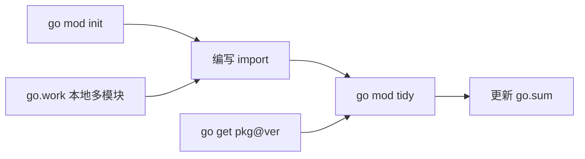

Go 的代码组织有一套清晰的层级：**package（包） → module（模块） → workspace（工作区）**。理解这三者的关系，是管理依赖、拆分项目、协同开发的基础。本文自底向上讲解这套体系，以及依赖是如何被下载和管理的。

## package 包

`package` 是 Go 中最小的代码组织单位。**同一个目录下的所有 `.go` 文件必须属于同一个 package。**

```go
// 文件 math/add.go
package math // 声明这个文件属于 math 包

func Add(a, b int) int {
    return a + b
}
```

### 可见性规则

Go 没有 `public`/`private` 关键字，而是通过**标识符首字母大小写**来控制可见性：

- **首字母大写**：导出（exported），包外可访问，相当于 public。
- **首字母小写**：私有（unexported），仅包内可访问，相当于 private。

```go
package math

func Add(a, b int) int { return a + b } // 大写 Add，包外可用
func sub(a, b int) int { return a - b } // 小写 sub，仅包内可用
```

### main 包

`package main` 是特殊的包，它是可执行程序的入口。其中必须包含一个 `main` 函数：

```go
package main

import "fmt"

func main() {
    fmt.Println("Hello Go")
}
```

只有 `main` 包能被 `go build` 编译成可执行文件；其他包只能被导入使用。

## module 模块

`module` 是一组相关 package 的集合，也是**依赖管理和版本发布的基本单元**。一个模块由根目录下的 `go.mod` 文件定义。

### 初始化模块

```bash
go mod init github.com/AsMuin/myproject
```

这条命令会生成 `go.mod` 文件，其中的模块路径 `github.com/AsMuin/myproject` 就是这个模块的唯一标识，也是别人 `import` 你的包时使用的前缀。

```go
// go.mod
module github.com/AsMuin/myproject

go 1.22
```

### 包的导入路径

模块内的包，其导入路径 = 模块路径 + 包所在的相对目录。假设项目结构如下：

```
myproject/
├── go.mod          // module github.com/AsMuin/myproject
├── main.go
└── math/
    └── add.go      // package math
```

那么在 `main.go` 中导入 `math` 包：

```go
package main

import (
    "fmt"
    "github.com/AsMuin/myproject/math" // 模块路径 + 相对目录
)

func main() {
    fmt.Println(math.Add(1, 2))
}
```

## 依赖下载与管理

当你导入一个外部模块的包时，Go 工具链会自动处理下载和版本记录。

### 添加依赖

直接在代码里 `import` 需要的包，然后运行：

```bash
go mod tidy
```

`go mod tidy` 会扫描代码中所有 `import`，**自动下载缺失的依赖、移除未使用的依赖**，并更新 `go.mod` 和 `go.sum`。这是最常用的依赖整理命令。

也可以手动添加指定版本：

```bash
go get github.com/gin-gonic/gin@v1.9.1 // 添加并锁定到指定版本
go get -u github.com/gin-gonic/gin      // 升级到最新的次要/补丁版本
```

### go.mod 与 go.sum

- **`go.mod`**：记录模块路径、Go 版本，以及**直接和间接依赖及其版本**。

```go
module github.com/AsMuin/myproject

go 1.22

require github.com/gin-gonic/gin v1.9.1

require (
    github.com/bytedance/sonic v1.9.1 // indirect  间接依赖
)
```

- **`go.sum`**：记录每个依赖模块的**校验和（哈希）**，用于验证下载内容未被篡改，保证构建可复现。**这个文件应当提交到版本控制。**

### 依赖存放位置与缓存

下载的依赖不会放进项目目录，而是统一缓存在本地的**模块缓存**中（默认 `$GOPATH/pkg/mod`），供所有项目共享。常用相关命令：

```bash
go clean -modcache // 清空模块缓存
go mod download    // 仅下载 go.mod 中声明的依赖，不改动代码
```

## workspace 工作区

`workspace`（Go 1.18 引入）用于**同时开发多个相互依赖的本地模块**。它解决的痛点是：当你在改一个模块的同时，需要让另一个模块立即用上未发布的改动。

### 传统做法的痛点

假设你在开发主项目时，同时也在修改一个自己的工具库。在没有 workspace 之前，你只能用 `replace` 指令把依赖临时指向本地路径：

```go
// go.mod 中
replace github.com/AsMuin/utils => ../utils
```

但这样的 `replace` 是模块私有的，容易误提交，也不便于管理多个本地模块。

### 使用 go.work

工作区通过一个 `go.work` 文件把多个本地模块组织在一起。假设目录结构：

```
workspace/
├── go.work
├── myproject/
│   └── go.mod   // module github.com/AsMuin/myproject
└── utils/
    └── go.mod   // module github.com/AsMuin/utils
```

初始化并添加模块：

```bash
cd workspace
go work init ./myproject ./utils
```

生成的 `go.work`：

```go
go 1.22

use (
    ./myproject
    ./utils
)
```

此时在 `myproject` 中 `import "github.com/AsMuin/utils"`，Go 会**优先使用工作区里的本地 `utils`**，而不是去下载已发布的版本。你对 `utils` 的改动能立刻在 `myproject` 中生效，无需发布、无需 `replace`。

**注意：`go.work` 是本地开发工具，通常不提交到版本控制（可加入 `.gitignore`），因为它反映的是个人开发环境的模块布局。**

## 小结

| 层级 | 作用 | 关键文件 |
| --- | --- | --- |
| package | 目录级代码单位，控制可见性 | 每个 `.go` 文件的 `package` 声明 |
| module | 依赖管理与版本发布单元 | `go.mod`、`go.sum` |
| workspace | 多本地模块协同开发 | `go.work` |

日常最常用的三条命令：`go mod init` 初始化模块、`go mod tidy` 整理依赖、`go get` 添加/升级指定依赖。


