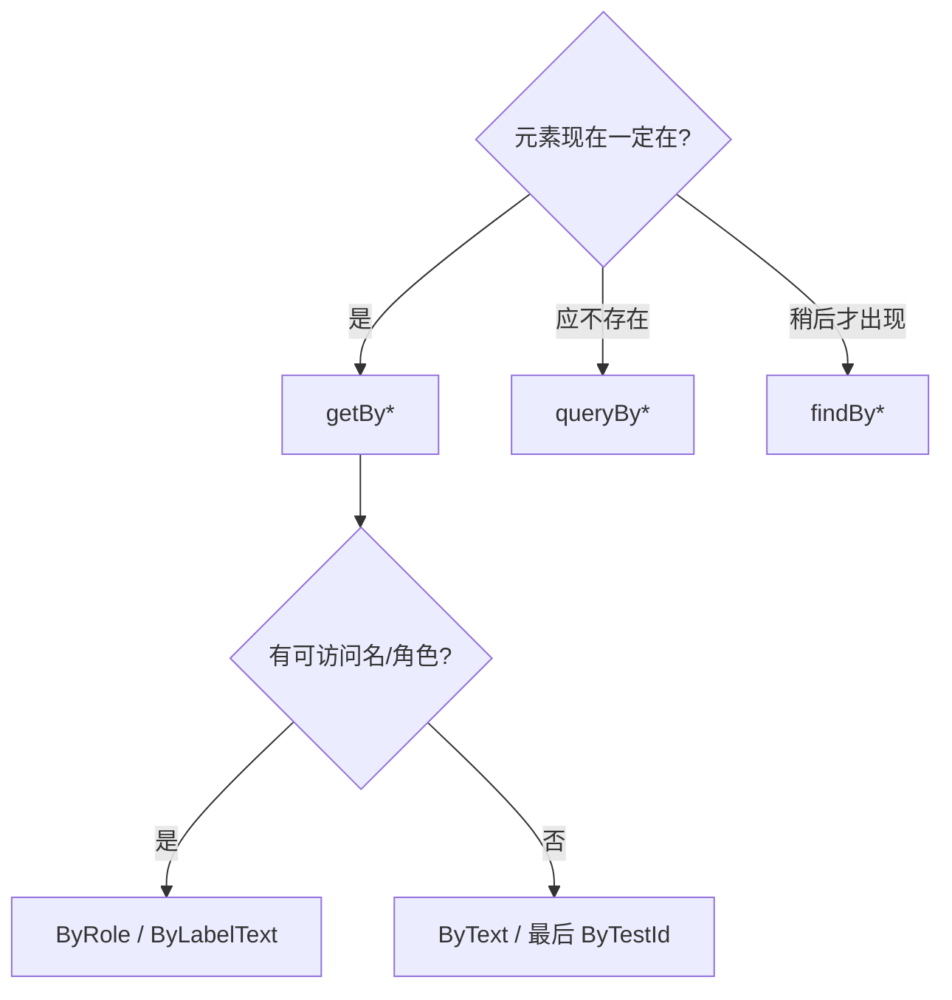

# 查询 DOM 方法

Testing Library 的查询按 **是否等待** 和 **找不到时的行为** 分成三组。优先按 [查询优先级](https://testing-library.com/docs/queries/about/#priority) 选：先 `getByRole` / `getByLabelText`，少用 `getByTestId`。

## getBy*

立即**同步**查找。找不到或多于一个匹配会**抛错**（多个匹配用 `getAllBy*`）。

适合：断言「这个元素现在必须在文档里」。

## queryBy*

同步查找。找不到返回 `null`，找到多个则抛错（多个用 `queryAllBy*`）。

适合：断言「这个元素不存在」——不要用 `getBy` 再 `try/catch`。

## findBy*

返回 **Promise**，在超时内（默认约 1000ms）等待元素出现。超时或匹配到多个会 reject（多个用 `findAllBy*`）。

适合：异步渲染、请求结束后才出现的节点。

## 对照表

| 方法 | 是否等待 | 找不到时 | 多个匹配 | 典型场景 |
| --- | --- | --- | --- | --- |
| `getBy*` | 否 | 抛错 | 抛错 | 已存在的元素 |
| `queryBy*` | 否 | `null` | 抛错 | 断言不存在 |
| `findBy*` | 是 | reject | reject | 异步出现 |

`*AllBy*` 变体返回数组，适合列表项等「可以有多个」的情况。

## 常用查询变体

| 查询 | 说明 |
| --- | --- |
| `...ByRole` | 按可访问性角色（button、textbox…），首选 |
| `...ByLabelText` | 表单控件关联的 label |
| `...ByPlaceholderText` | placeholder（不如 label 稳） |
| `...ByText` | 可见文本 |
| `...ByDisplayValue` | 输入当前显示值 |
| `...ByAltText` / `...ByTitle` | 图片 alt、title |
| `...ByTestId` | 测试专用 id，尽量最后用 |

## 最小示例

```tsx
import { render, screen } from '@testing-library/react';
import userEvent from '@testing-library/user-event';

test('提交后出现成功提示', async () => {
  const user = userEvent.setup();
  render(<LoginForm />);

  await user.type(screen.getByLabelText('邮箱'), 'a@b.com');
  await user.click(screen.getByRole('button', { name: '登录' }));

  // 异步出现的节点用 findBy
  expect(await screen.findByText('登录成功')).toBeInTheDocument();

  // 断言不存在用 queryBy
  expect(screen.queryByText('请先登录')).not.toBeInTheDocument();
});
```

## 怎么选



与事件模拟见 [模拟交互事件](./event)。
