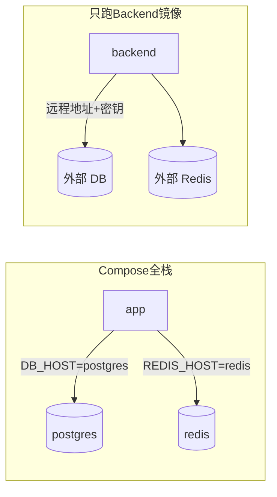

## 总结

两种常见形态：

1. **Compose 全栈**：同一台机（或同一 Docker 网络）里一起起 Postgres / Redis / Backend，网络与连接信息多半由编排**写死或同源注入**。
2. **只跑 Backend 镜像**：CI 打出应用镜像；生产只拉这个镜像跑，库和缓存在外部，靠**部署时注入 env** 告诉进程远程地址。

核心不是「有没有 `.env` 文件」，而是：**进程最终读到的环境变量从哪来、值对不对得上它所在的网络位置。**

---

## 先分清三层

| 层 | 是什么 | 典型内容 |
| -- | ------ | -------- |
| **服务本身** | Postgres / Redis 容器怎么初始化 | `POSTGRES_USER` / `PASSWORD` / `DB` |
| **客户端连接** | Backend 怎么连库、连缓存 | `DB_HOST`、`POSTGRES_PORT`、`REDIS_HOST`… |
| **配置来源** | 这些值谁填进进程 | `.env`、Compose `environment`、K8s Secret、`docker run -e` |

Backend **不会**自动读 `docker-compose.yml`。进程侧常见优先级是：

```text
已存在的环境变量（容器 / 系统已注入，优先）
  → godotenv 等只补缺、默认不覆盖已有 env
  → 代码里的 default fallback
```

镜像里通常**只有二进制**，不含你本机的 `.env`。



---

## 方案 A：Compose 编排整套服务

### 在做什么

```text
docker compose up
  ├── postgres   （官方镜像 + 初始化 env）
  ├── redis
  └── app        （backend 镜像/build，同一 Docker 网络）
```

同一网络内用**服务名**做 DNS，例如 `postgres`、`redis`。

### 连接关系

```text
app 容器内：
  DB_HOST=postgres      ← 服务名，不是 localhost
  REDIS_HOST=redis
  POSTGRES_PORT=5432    ← 容器内端口（一般固定）
```

**坑：** 在 app **容器里**写 `DB_HOST=localhost` 会连到 app 自己，而不是数据库。

### env 怎么注入

| 变量类型 | 谁写 | 说明 |
| -------- | ---- | ---- |
| `POSTGRES_USER/PASSWORD/DB` | Compose 给 **postgres 服务** + **app 服务**（常 `${VAR:-default}` 同源） | 初始化账号与客户端账号要对齐 |
| `DB_HOST` / `REDIS_HOST` / `POSTGRES_PORT` 等 | Compose **写死**进 app（`postgres` / `redis`） | **应用客户端**配置名；Postgres 官方镜像不认 `DB_HOST`/`POSTGRES_PORT`，它们只给 backend 用 |
| 日志 `ENV` / `LOG_LEVEL` 等 | 可选，从 `.env` 插值进 app | 运维向参数 |

Compose 读项目根目录 `.env` 的方式是：

```text
磁盘 .env
  → 替换 YAML 里的 ${POSTGRES_PASSWORD} 等
  → 变成容器的 environment
```

默认**不会**把整个 `.env` 文件挂进容器；容器里进程看到的是已经算好的环境变量。

### 开发变体：Compose 只起依赖

```text
compose 只起 postgres + redis（端口映射到宿主机）
本机 go run ./cmd/server
```

这时 backend 在**宿主机**：

```text
DB_HOST=localhost
REDIS_HOST=localhost
端口 = 映射出来的 5432 / 6379
```

代码默认常常就是这样，**本地可以不写 `.env`**。  
宿主端口映射（`5432:5432`）属于开发便利，不必全部做成可配项。

### 何时 host/port「没什么可配的」

若生产也用 Compose 在**同一网络**起全套 app + 中间件：

- `DB_HOST` / `POSTGRES_PORT` **对人**几乎不用调——编排已经定死拓扑
- 变量**仍存在**：Compose 注入它们，app 才能连上
- 仍要管的是 **密码、库名、日志级别** 等

---

## 方案 B：只部署 Backend 镜像（更接近常见生产）

### 在做什么

```text
CI：测试 → build 镜像 → push GHCR（等）
生产：只 pull backend 镜像运行
       Postgres / Redis 在别处（托管库、另一台机、K8s 另一套服务）
```

Compose 可以仍用于本地/预发，但**不是**生产唯一形态。

### 连接关系

```text
backend 容器/进程
  DB_HOST=<远程域名或内网 IP 或 K8s Service>
  POSTGRES_PORT=<远程端口，常见 5432>
  REDIS_HOST=...
  POSTGRES_PASSWORD=...   # 真密钥，来自 Secret
```

### env 怎么注入

| 方式 | 例子 |
| ---- | ---- |
| `docker run -e` / `--env-file` | 单机试跑 |
| Compose 只起 app，中间件外部 | `environment` / `env_file` 指向真实地址 |
| K8s | Deployment `env` / ConfigMap / Secret |
| 云平台面板 | 运行配置里的环境变量 |

**镜像构建阶段不会、也不该 bake 进生产密钥和远程地址。**  
CI 里的 DB env 只给 **测试 job** 连临时 service，与生产配置无关。

### 和方案 A 的本质差

| | Compose 全栈 | 独立 Backend 镜像 |
| -- | ------------ | ----------------- |
| 中间件位置 | 与 app 同编排网络 | 外部 |
| `DB_HOST` 典型值 | 服务名 `postgres` | 远程主机名 |
| 谁决定 host/port | 编排 YAML 写死/固定 | **部署配置**必填 |
| `.env` 角色 | 本地插值 + 可选密钥 | 往往不用；用平台 Secret |
| CI 产物 | 可选 | **核心是 app 镜像** |

---

## `.env` 到底谁在用

| 使用者 | 用途 |
| ------ | ---- |
| 本机 `go run` | `godotenv` 读当前目录 `.env`（没有则忽略，走默认） |
| Docker Compose | 自动读根目录 `.env` 做 **`${VAR}` 替换** |
| CI | **通常没有** `.env`（gitignore）；workflow 自带测试 env |
| 镜像 runtime | **默认没有** `.env` 文件；只看注入的环境变量 |

原则：

- **开发默认**靠代码 fallback（如 `localhost`、`postgres/postgres`）即可时，不必堆一堆「几乎不改」的开发专用旋钮。
- **CI / 生产会变的**（远程 host、密码、日志、环境名）保留为显式契约。

---

## 变量再拆两类（避免混）

### 1. 只有 Backend 当客户端读

- `DB_HOST`、`POSTGRES_PORT`
- `REDIS_HOST`、`REDIS_PORT`、`REDIS_PASSWORD`

Postgres 官方镜像**不读** `DB_HOST`；它只在自己的 5432 上听。

### 2. 镜像初始化 + Backend 连接共用（名字常对齐官方镜像）

- `POSTGRES_USER` / `POSTGRES_PASSWORD` / `POSTGRES_DB`

Compose 里给 postgres 初始化一份，给 app 连接再注同一套，避免账号对不上。

---

## 容易对不上的情况

| 场景 | 错误配置 | 结果 |
| ---- | -------- | ---- |
| 宿主机跑 backend | `DB_HOST=postgres` | 宿主机没有该 DNS → 连不上 |
| app 在 compose 里 | `DB_HOST=localhost`（若未被 compose 覆盖） | 连到自己 → 连不上 |
| 改了客户端端口 | `POSTGRES_PORT=5433`，映射仍是 5432 | 连不上 |
| 只改了 app 密码、没改库初始化 | 两边 `POSTGRES_PASSWORD` 不一致 | 认证失败 |

Compose 全栈若对 app **写死** `DB_HOST=postgres`，你在 `.env` 写 `DB_HOST=localhost` **通常影响不到 app 容器**（被 YAML 覆盖），但会影响本机 `go run`。

---

## 选型速记

```text
本地开发
  → compose 起依赖 + 本机进程：默认 localhost 即可
  → 或 compose --profile full：靠服务名注入

单机演示 / 小团队「一键 compose 起全套」
  → 拓扑固定，host/port 给人配的意义不大；管好密钥与日志

真·生产（拆分中间件）
  → 只部署 backend 镜像
  → 部署系统注入远程 DB/Redis 与密钥
  → DB_HOST / 端口 / 密码 是核心配置，不是可有可无
```

---

## 一句话

**Compose 负责「在同一网络里把服务摆好并替 app 填好连接 env」；生产镜像部署负责「只交付 app，连接信息在运行时从外部注入」。**  
`.env` 是本地/Compose 的配置源之一，不是镜像内容，也不是 CI 的配置源。同一套键名（`DB_HOST`、`POSTGRES_*`…）在两种方案里都出现，**值随拓扑变，注入渠道也不同。**
