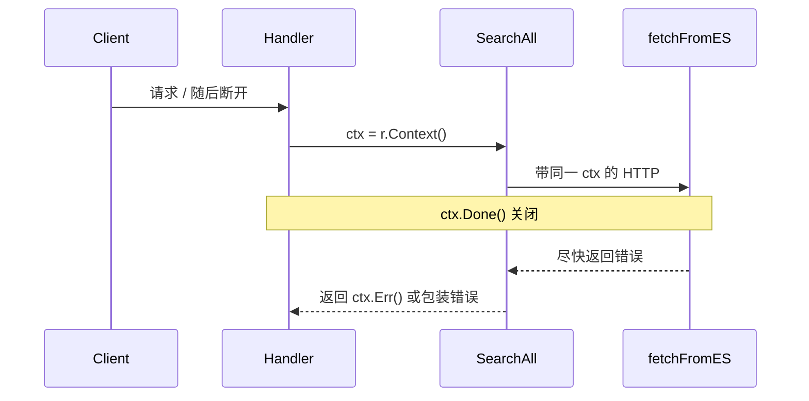

## 前言

**`context` 的职责是传递取消信号、截止时间和请求范围的数据，而不是替业务代码决定"取消之后该返回什么结果"。**

也就是说，它本质上是一种**协作式取消机制**，而不是运行时层面的抢占式终止。

## 只是"广播信号"

官方语义里，`context` 主要做三件事：

- 传递取消信号
- 传递 deadline / timeout
- 传递 request-scoped value

当上游取消后，下游通过：

```go
select {
case <-ctx.Done():
    return ctx.Err()
default:
}
```

或者在调用支持 `Context` 的 API 时，让这些 API 提前结束。

比如：

- `http.NewRequestWithContext`
- `db.QueryContext`
- `exec.CommandContext`

重点是：**`cancel()` 只负责广播取消信号，不负责自动回滚业务状态，不负责自动构造部分结果，也不负责定义 HTTP 响应语义。**

## 核心性质

### 1. `context` 不是强杀

`context` 的核心机制，是通过关闭 `Done()` 通道向调用链下游传播取消信号。至于 goroutine 何时退出、以什么方式退出，取决于调用方是否主动检查 `ctx.Done()`，或所调用的 API 是否原生支持 `Context`。

它更接近：

> 上游通知下游：当前请求已经失效，后续工作应尽快停止。

而不是：

> 运行时直接中断 goroutine 的执行现场。

### 2. 怎么收工，由各层自己决定

对于同一类取消信号，不同业务逻辑可以采取不同的收尾策略：

- 查询类接口：直接返回错误
- 聚合类接口：返回已收集到的部分结果
- 数据库事务：回滚事务
- 文件下载：记录进度，等待下次续传

这些行为都不由 `context` 决定，而是由**业务层自行定义取消后的语义**。

### 3. `context` 解耦了生命周期控制和业务返回值

同一个底层函数，只要遵守 `Context` 传播约定，就可以复用于不同场景：

- A 场景要"尽量给部分结果"
- B 场景要"一旦取消就整次作废"

`context` 只负责表达：**当前调用的生命周期约束已经发生变化。**

至于上层如何解释这个变化，是返回部分结果、丢弃结果、触发重试，还是转换成错误响应，属于上层策略。

## 边界

### 1. 不是所有函数都会"自己安排部分结果"

更准确地说：

**函数可以选择返回部分结果，也可以选择直接返回错误。**

Go 里更常见、也更稳妥的默认做法其实是：

- 发现 `ctx.Done()`
- 尽快停止
- 返回 `ctx.Err()` 或包装后的错误

"返回部分结果"通常属于**显式的业务容错设计**，不是 `context` 的默认语义。

### 2. 回滚也不是 `context` 自动做的

例如数据库事务回滚，真正执行回滚动作的是：

- 你自己写的 `tx.Rollback()`
- 或数据库驱动、事务封装层在收到取消后执行的清理逻辑

所以更准确的表述应该是：

**`context` 负责通知取消；资源释放、事务回滚、结果保留与否，由具体代码或具体库负责。**

## HTTP 后端场景

假设有一个搜索接口：

```go
// import "context" / "errors" / "encoding/json" / "net/http" …
func SearchHandler(w http.ResponseWriter, r *http.Request) {
    ctx := r.Context()

    result, err := SearchAll(ctx, r.URL.Query().Get("q"))
    if err != nil {
        // 不要把所有错误都映射成 504：取消 / 超时 / 业务错误语义不同
        if errors.Is(err, context.DeadlineExceeded) {
            http.Error(w, err.Error(), http.StatusGatewayTimeout)
            return
        }
        if errors.Is(err, context.Canceled) {
            // 客户端已断开时，有时甚至不必再写响应
            return
        }
        http.Error(w, err.Error(), http.StatusInternalServerError)
        return
    }

    json.NewEncoder(w).Encode(result)
}
```

这里的 `r.Context()` **常见**会在以下场景被取消：

- 用户主动断开连接
- 到后端的连接被代理关闭（不一定等于“代理配置了超时”这一个原因）
- 上游已经不再等待这次响应

因此 `SearchAll` 内部应该继续向下传递 `ctx`：

```go
func SearchAll(ctx context.Context, query string) ([]Item, error) {
    items, err := fetchFromES(ctx, query)
    if err != nil {
        return nil, err
    }

    detail, err := fetchDetail(ctx, items)
    if err != nil {
        return nil, err
    }

    return merge(items, detail), nil
}
```

如果某一层正在等待外部 I/O，就应该通过支持 `Context` 的调用方式响应取消：

```go
func fetchFromES(ctx context.Context, query string) ([]Item, error) {
    req, err := http.NewRequestWithContext(ctx, http.MethodGet, "http://search.internal?q="+query, nil)
    if err != nil {
        return nil, err
    }

    resp, err := http.DefaultClient.Do(req)
    if err != nil {
        return nil, err
    }
    defer resp.Body.Close()

    return decodeItems(resp.Body)
}
```

如果客户端断开：

- `r.Context()` 被取消
- `SearchAll` 这条调用链上的下游感知到 `ctx.Done()`
- 正在进行的 HTTP / DB / RPC 请求如果支持 `Context`，也会尽快结束

这正是 `context` 的核心价值：**将"当前请求已无继续执行必要"这一生命周期信号沿调用链持续传播。**

## 取消信号如何向下走



## 总结

- `context` 是**协作式取消机制**，不是抢占式终止
- 它负责传递**取消信号、超时约束和请求范围数据**
- 取消后的返回语义由**业务层自行定义**
- 回滚、清理、资源释放由**具体代码或具体库负责**
- 在 HTTP 后端中，应优先从 `r.Context()` 开始向下传播
- 调用外部资源时，应优先使用支持 `Context` 的 API

**`context` 决定的是调用是否还应继续执行，但不决定取消后的业务收尾策略。**
