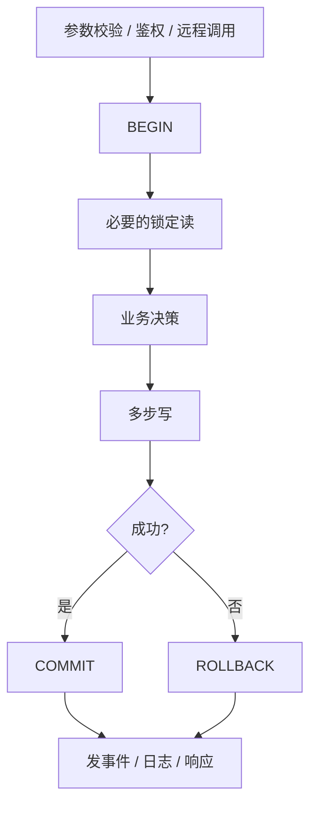
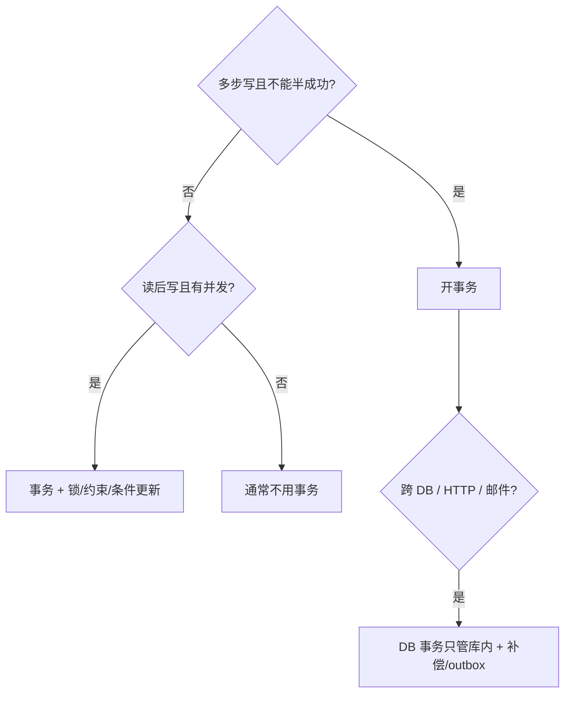

## 总结

**当事情需要「多步写，要么全成要么全不成」时，就该上事务。**

读多写少、单条写、失败可重试且允许中间态时，通常不必。  
「加了事务更安心」不是充分理由——长事务会拖锁、拉高冲突。

---

## 优先开事务的信号

### 1. 一次业务对应多条写

典型形态：A 表插一行 + B 表插/改一行，中间失败不能留下半成品。

| 例子                        | 为何要事务                     |
| --------------------------- | ------------------------------ |
| 建队 + 写入队长成员         | 不能只有队伍没有队长关系       |
| 扣库存 + 写订单行           | 不能只扣库存不成单             |
| 软删主实体 + 软删全部关联   | 不能主没了明细还在（或反过来） |
| 改负责人 + 原负责人退出关联 | 两步必须同成同败               |

**判定：** 若只成功一半，数据是否语义错误？会 → 开事务。

### 2. 先读后写，且读结果决定写什么（check-then-act）

「查人数 → 未满 → 插入」「查是否成员 → 再退出」在并发下会脏。

| 手段                           | 作用                         |
| ------------------------------ | ---------------------------- |
| **事务**                       | 把读和写放进同一边界         |
| **行锁 / 条件更新 / 唯一约束** | 防止别人插队改掉你的决策依据 |

常见组合：事务内 `SELECT … FOR UPDATE` 关键再按快照决策并写入。

**判定：** 并发下「我看到的状态」和「我写的时候」可能不一致 → 事务，高并发再加锁或约束。

### 3. 多表 / 多行必须保持不变量

例如：

- 账户 A 减 X 且账户 B 加 X（总额不变）
- 主表状态与明细条数一致
- 「有效成员」与队长必须同属一队且都有效

不变量跨多行时，用事务把变更收成一个原子版本。

### 4. 失败必须能回到干净点

纯 DB 多步写失败 → 事务回滚最省事。

注意：**事务管不了 HTTP、Redis、发邮件**。跨系统步骤要补偿、outbox 或先写库再异步投递。

### 5. 业务上只允许看到完成态

对账、并发读不能看到「只改了一半」的结构 → 事务缩小中间态窗口（再配合隔离级别）。

---

## 可以先不加事务的情况

| 场景                                | 原因                           |
| ----------------------------------- | ------------------------------ |
| 单行 `INSERT` / `UPDATE` / `DELETE` | 单语句本身原子                 |
| 纯查询                              | 无写；要一致快照再考虑只读事务 |
| 多步只读                            | 一般无事务                     |
| 允许中间态、最终一致                | 如异步任务事后对齐             |
| 幂等重试即可                        | 失败重跑，不依赖半成功回滚     |
| 吞吐优先且不变量弱                  | 产品接受后再拆小事务或异步     |

---

## 事务还不够：隔离与竞态

| 只有事务               | 事务 + 行锁 / 约束                               |
| ---------------------- | ------------------------------------------------ |
| 防「半成功」留下脏数据 | 防并发下的**错误成功**（两人同时看到未满都加入） |
| 适合冲突少、低频写     | 适合名额、余额、容量上限等                       |

记法：

- **一致性（all-or-nothing）** → 事务  
- **隔离（别人别插队）** → 行锁 / 乐观版本 / 唯一约束 / 条件 `UPDATE`

有事务 ≠ 没有竞态。两人仍可都读到「未满」再都插入，除非互斥或约束兜住。

---

## 实操决策清单

接到写接口时问自己：

1. **是否超过一条写 / 多表？** → 倾向事务  
2. **中间失败留下的数据能不能接受？** → 不能则事务  
3. **是否依赖「刚才读到的」状态再写？** → 事务；有并发再加锁/约束  
4. **是否有跨服务 / 非 DB 步骤？** → DB 事务只管库内  
5. **事务大概持有多久？** → 只包必要读写；远程调用、重计算放事务外  
6. **隔离要多强？** → 许多业务在 **Read Committed + 条件更新/锁/唯一约束** 下就够；**不要假设“数据库默认都是 RC”**（PostgreSQL 默认 RC，MySQL InnoDB 默认 RR）。资金类再提高隔离或上条件更新。

---

## 事务边界怎么画

推荐形状：



```text
参数校验、鉴权、远程调用（事务外）
        ↓
BEGIN
  必要的锁定读
  业务决策
  多步写
COMMIT / ROLLBACK
        ↓
发事件、写日志、返回响应（事务外；强一致投递用 outbox）
```

避免：

- 每个 Service 方法无脑包一层大事务  
- 事务里调慢 RPC、sleep  
- commit 半成品后再返回业务失败  

业务拒绝应 **回滚并返回错误**，不要先提交脏状态。

---

## 决策速查



## 记法

```text
多步写 + 不能半成功     →  开事务
读结果驱动写 + 有并发   →  事务，并考虑锁/约束
单语句 / 允许中间态     →  通常不用事务
```

开发任务里：先画「这次请求碰几张表、几步写、失败时库里能否脏」。  
答案是「会脏」就上事务，再按并发强度决定要不要行锁或唯一约束。
