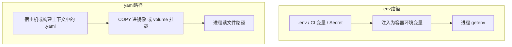

## 总结

两者不是二选一：

| | `.env` / 环境变量 | YAML（等结构化配置文件） |
| -- | -- | -- |
| **管什么** | 环境差异、密钥、进程启动参数 | 有层级的业务/运行参数 |
| **形态** | 扁平 `KEY=VALUE` | 嵌套、列表、注释 |
| **进程怎么拿到** | 已是环境变量（`os.Getenv` / `process.env`） | 读文件再解析 |
| **Git** | 真值不提交，只交 `.env.example` | 无密钥则可提交；可按环境拆多份 |
| **Docker 注入** | `-e` / `--env-file` / Compose `environment` | `COPY` 或 volume 挂载成**文件** |

一句话：**密钥与环境差异走环境变量；结构化业务配置走 YAML。**  
「有没有磁盘上的 `.env` 文件」不重要，重要的是**进程最终读到的 env 从哪来**——见 [Compose vs 生产镜像部署](/sawdust/compose-vs-prod-image-env)。

---

## 什么时候用哪个

### 环境变量（本地常用 `.env` 生成）

- 库密码、API Key、Token
- `APP_ENV` / `NODE_ENV`
- 会随部署环境变的 host、端口、日志级别

特征：**敏感**或**随环境变**，且值本身是标量。

注意：`.env` **不是**保险柜，只是本地/编排侧的一种填 env 的方式。生产优先 Secrets Manager、K8s Secret、平台注入的环境变量；镜像里不要塞真实 `.env`。

### YAML

- 连接池大小、超时、重试
- Feature flag、路由/限流规则
- 多上游地址列表、缓存策略等嵌套结构

特征：**要层级/数组/可读注释**，且多数不随密钥轮转。

### 常见组合

```text
环境变量：APP_ENV、DB_PASSWORD、第三方密钥…
     ↓
应用按 APP_ENV 选配置文件（或只认一个固定路径）
     ↓
YAML：pool、timeout、开关、业务规则…
YAML 里可用占位/覆盖机制引用 env（视框架而定）
```

不要：把整份业务 YAML 拍平成几十个 `FOO_BAR_BAZ`；也不要把密码写进可提交的 `config.yaml`。

---

## Docker：两条完全不同的注入路径



### 1. 环境变量

```bash
# 直接传
docker run -e DB_HOST=mysql -e DB_PASSWORD=secret my-app

# 从文件批量注入（文件本身不必进镜像）
docker run --env-file .env my-app
```

Compose：

```yaml
services:
  app:
    image: my-app
    env_file:
      - .env                 # 变成容器环境变量
    environment:             # 覆盖 env_file 同名项
      APP_ENV: production
```

**分清三种「.env」：**

| 机制 | 作用对象 | 结果 |
| ---- | -------- | ---- |
| 项目根目录 `.env`（Compose 默认） | **编排文件**里的 `${VAR}` | 替换 compose YAML；**不**自动进容器 |
| `env_file:` / `docker --env-file` | **容器** | 键值写入进程环境 |
| 应用内 godotenv 等 | 进程自己读文件 | 常只补缺，不覆盖已有 env |

生产更稳的是平台/编排直接给环境变量或 Secret，而不是依赖镜像内读 `.env`。

### 2. YAML 文件

文件就得当文件处理：构建打进镜像，或启动时挂进去。

```dockerfile
# 构建期打进镜像：简单，改配置要重建
COPY config.yaml /app/config.yaml
```

```bash
# 运行时挂载：改配置不用重建（常用）
docker run -v "$(pwd)/config.yaml:/app/config.yaml:ro" my-app
```

```yaml
# Compose
services:
  app:
    volumes:
      - ./config.yaml:/app/config.yaml:ro
```

**按环境换文件时，插值发生在哪一侧要分清：**

```yaml
# ✅ Compose 解析 compose 文件时，用「宿主机 shell / 项目 .env」替换
#    与容器内 environment 不是一回事
services:
  app:
    env_file: .env
    environment:
      APP_ENV: production          # 给容器进程看
    volumes:
      # ${APP_ENV} 来自 Compose 插值源（项目 .env / shell），不是上面 environment 的魔法同步
      - ./config.${APP_ENV}.yaml:/app/config.yaml:ro
```

更稳、也更常见的两种做法：

1. **挂死一个路径**，容器内用 `APP_ENV` 决定读 `config/production.yaml` 还是 `config/dev.yaml`（多文件一起挂或打进镜像）。
2. **编排侧写死**要挂哪份：`./config/production.yaml:/app/config.yaml:ro`。

构建期按环境 `COPY` 必须用 **build ARG**，运行时 `ENV` 改不了已经执行完的 `COPY`：

```dockerfile
ARG APP_ENV=production
COPY config.${APP_ENV}.yaml /app/config.yaml
```

```bash
docker build --build-arg APP_ENV=staging -t my-app .
```

---

## 推荐骨架

```yaml
# docker-compose.yml（示意）
services:
  app:
    build: .
    env_file:
      - .env
    environment:
      APP_ENV: production
    volumes:
      - ./config.yaml:/app/config.yaml:ro
```

| 类型 | 放哪 |
| ---- | ---- |
| 密码、Token、环境标识、随部署而变的地址 | 环境变量（本地可用 `.env` 生成） |
| 池化、超时、开关、规则、嵌套结构 | YAML（或同级的 TOML/JSON） |

---

## 生产注意几条

1. 真实 `.env` 不进 Git；示例用 `.env.example`。
2. 密钥：Swarm/K8s Secret、云厂商 Secrets Manager / Parameter Store 等，按平台选。
3. YAML 可进镜像的前提是**无敏感项**；有密钥就拆到 env/Secret，或运行时挂只读密文并限制权限。
4. 配置缺失或校验失败应**启动直接失败**，别带错配置跑起来。
5. 需要改配置就热更时，优先挂载 + 进程支持重载（或滚动发布）；不要为了省事把密钥写进可挂载的明文业务配置里并提交仓库。

---

## 记法

```text
敏感 / 随环境变的标量     →  环境变量（.env 只是本地填法之一）
结构化业务配置           →  YAML 文件
Docker 给 env            →  -e / --env-file / environment
Docker 给 YAML           →  volume（常）或 COPY（少改时）
Compose 的 ${VAR}        →  替换的是编排文件，不是容器自动读 .env
```
